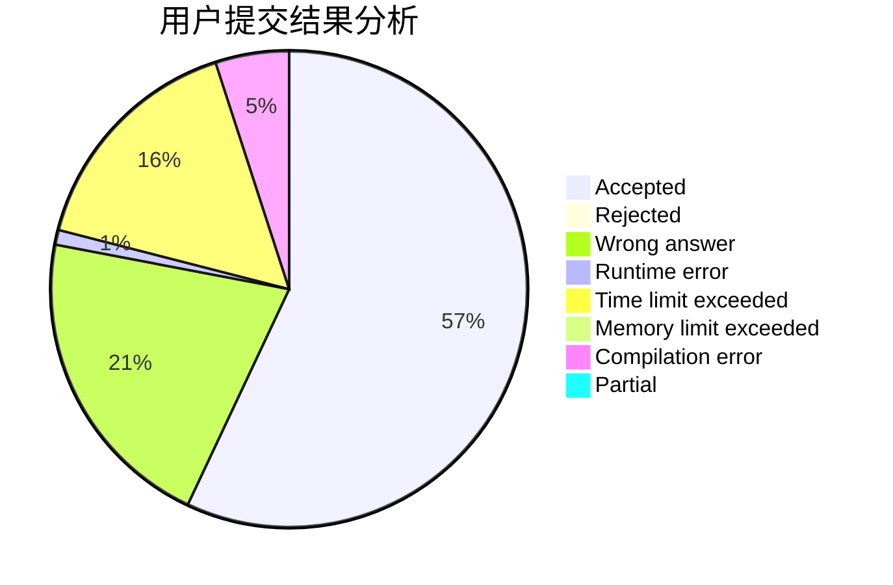
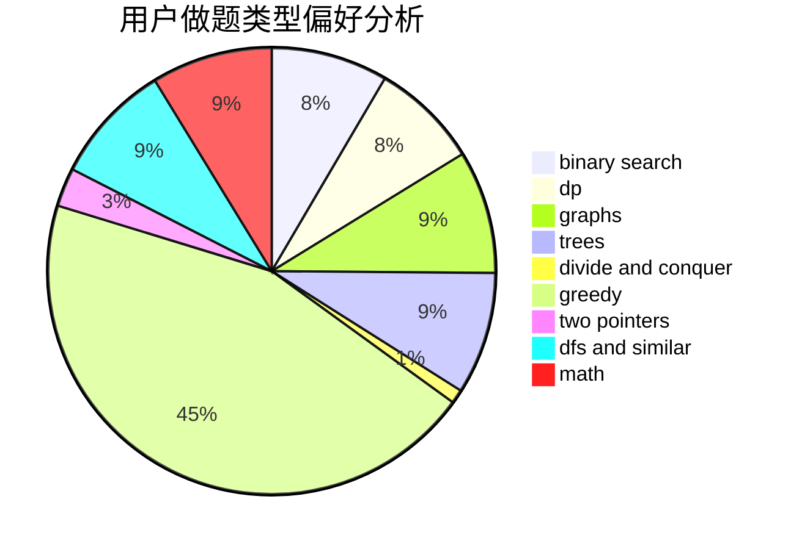

# tianxiawoyou

<!-- tabs:start -->

#### **用户提交结果分析**

#### **用户做题类型偏好分析**

<!-- tabs:end -->
# 推荐题目
[115B](https://codeforces.com/contest/115/problem/B)
[1016B](https://codeforces.com/contest/1016/problem/B)
[382E](https://codeforces.com/contest/382/problem/E)
[370A](https://codeforces.com/contest/370/problem/A)
[716A](https://codeforces.com/contest/716/problem/A)
[13573](https://codeforces.com/contest/1357/problem/3)
[1095F](https://codeforces.com/contest/1095/problem/F)
[496B](https://codeforces.com/contest/496/problem/B)
[1316F](https://codeforces.com/contest/1316/problem/F)
[1099E](https://codeforces.com/contest/1099/problem/E)
