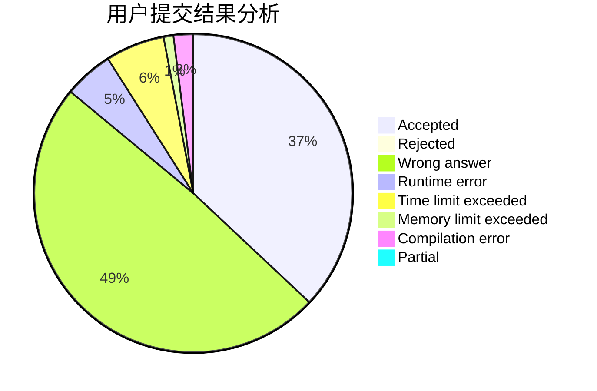
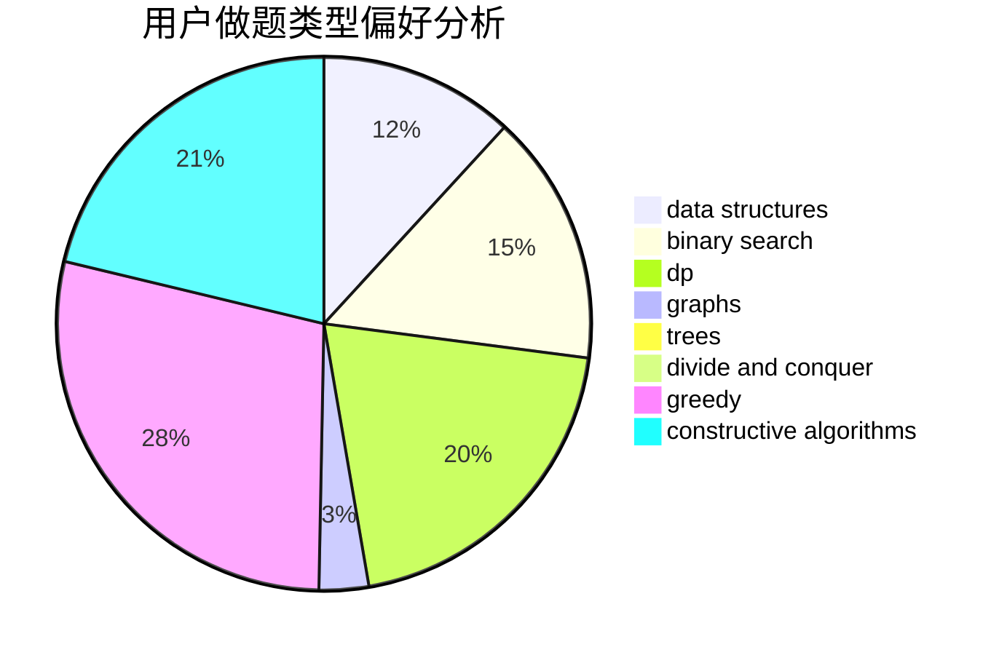
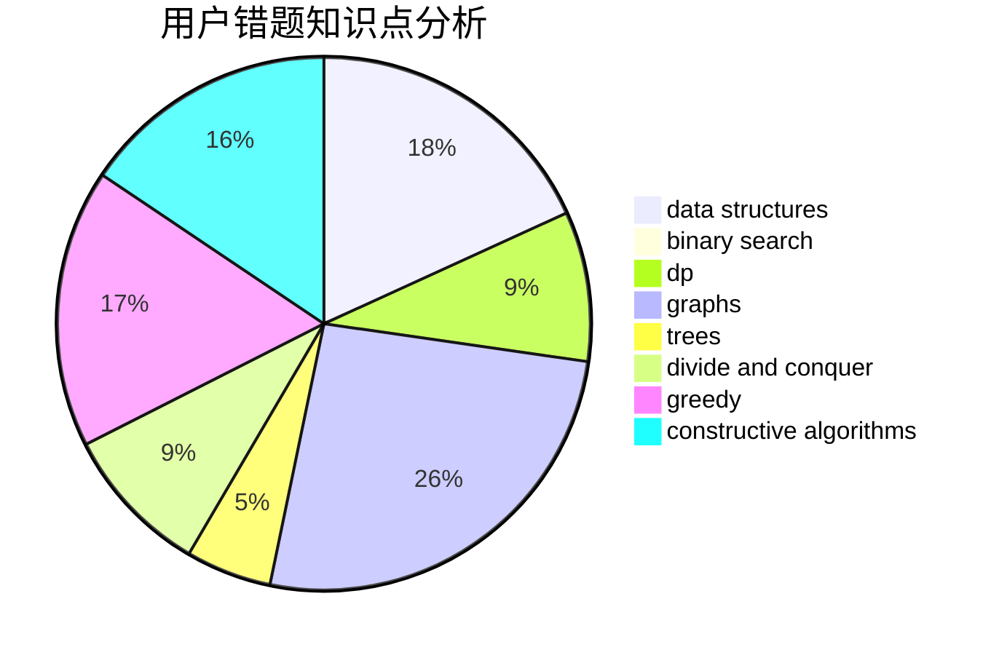

# tiany7

<!-- tabs:start -->

#### **用户提交结果分析**

#### **用户做题类型偏好分析**

#### **用户错题知识点分析**

<!-- tabs:end -->
# 推荐题目
[962G](https://codeforces.com/contest/962/problem/G)		data structures,
                        dsu,
                        geometry,
                        trees		  
[7B](https://codeforces.com/contest/7/problem/B)		implementation		  
[439C](https://codeforces.com/contest/439/problem/C)		brute force,
                        constructive algorithms,
                        implementation,
                        number theory		  
[802B](https://codeforces.com/contest/802/problem/B)		data structures,
                        greedy		  
[1417F](https://codeforces.com/contest/1417/problem/F)		dsu,graphs,sortings,trees		  
[591A](https://codeforces.com/contest/591/problem/A)		implementation,
                        math		  
[1078D](https://codeforces.com/contest/1078/problem/D)		dsu,graphs,sortings,trees		  
[616D](https://codeforces.com/contest/616/problem/D)		binary search,
                        data structures,
                        two pointers		  
[360D](https://codeforces.com/contest/360/problem/D)		number theory		  
[776E](https://codeforces.com/contest/776/problem/E)		math,
                        number theory		  
