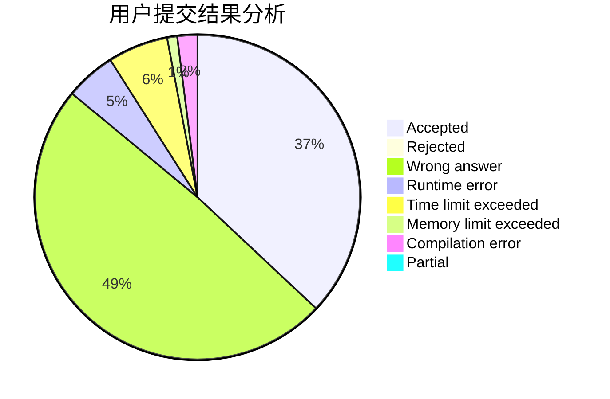
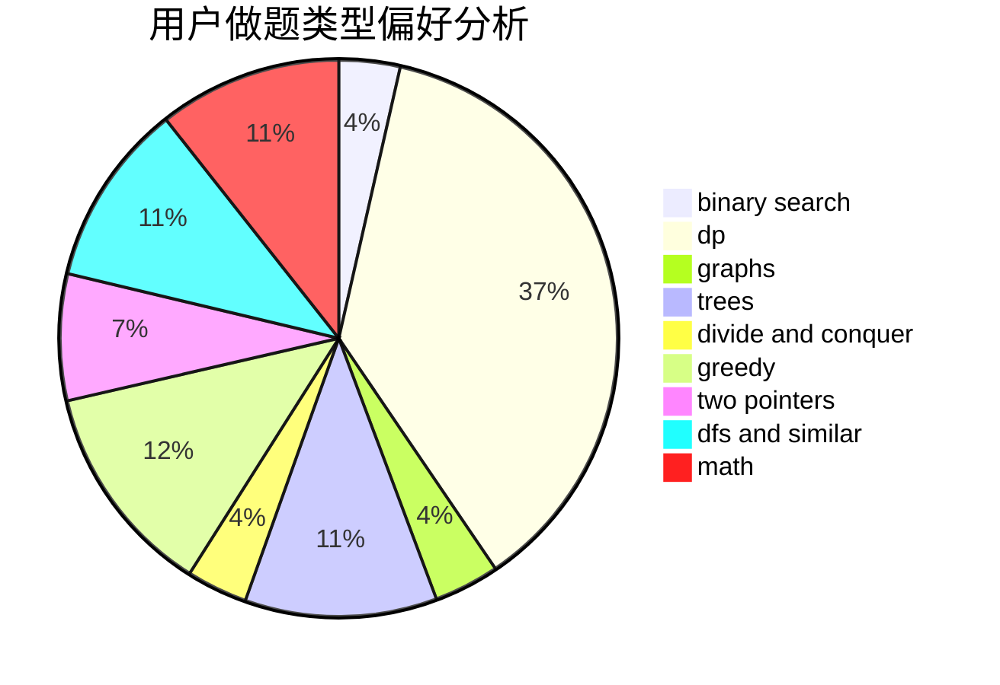

# tiany7

<!-- tabs:start -->

#### **用户提交结果分析**

#### **用户做题类型偏好分析**

<!-- tabs:end -->
# 推荐题目
[985E](https://codeforces.com/contest/985/problem/E)
[814C](https://codeforces.com/contest/814/problem/C)
[460D](https://codeforces.com/contest/460/problem/D)
[817A](https://codeforces.com/contest/817/problem/A)
[1425D](https://codeforces.com/contest/1425/problem/D)
[610D](https://codeforces.com/contest/610/problem/D)
[1079B](https://codeforces.com/contest/1079/problem/B)
[634A](https://codeforces.com/contest/634/problem/A)
[388E](https://codeforces.com/contest/388/problem/E)
[794E](https://codeforces.com/contest/794/problem/E)
