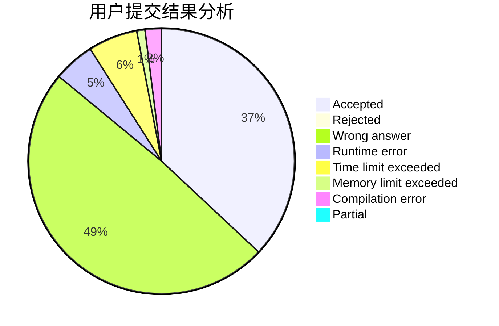
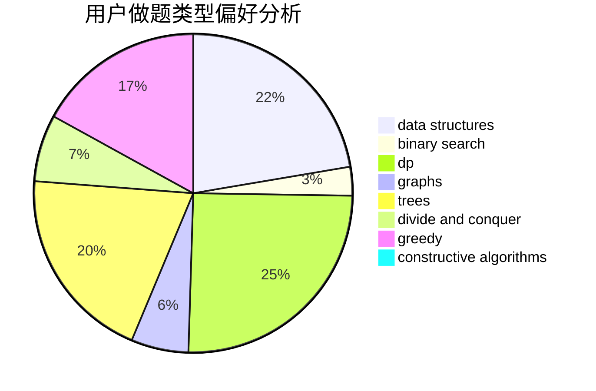

# tiany7

<!-- tabs:start -->

#### **用户提交结果分析**

#### **用户做题类型偏好分析**

#### **用户错题知识点分析**

<!-- tabs:end -->
# 推荐题目
[985E](https://codeforces.com/contest/985/problem/E)		binary search,
                        data structures,
                        dp,
                        greedy,
                        two pointers		  
[814C](https://codeforces.com/contest/814/problem/C)		brute force,
                        dp,
                        strings,
                        two pointers		  
[460D](https://codeforces.com/contest/460/problem/D)		brute force,
                        constructive algorithms,
                        math		  
[817A](https://codeforces.com/contest/817/problem/A)		implementation,
                        math,
                        number theory		  
[1425D](https://codeforces.com/contest/1425/problem/D)		combinatorics,
                        dp,
                        math		  
[610D](https://codeforces.com/contest/610/problem/D)		constructive algorithms,
                        data structures,
                        geometry,
                        two pointers		  
[1079B](https://codeforces.com/contest/1079/problem/B)		dsu,graphs,sortings,trees		  
[634A](https://codeforces.com/contest/634/problem/A)		constructive algorithms,
                        implementation		  
[388E](https://codeforces.com/contest/388/problem/E)		geometry		  
[794E](https://codeforces.com/contest/794/problem/E)		games,
                        math		  
