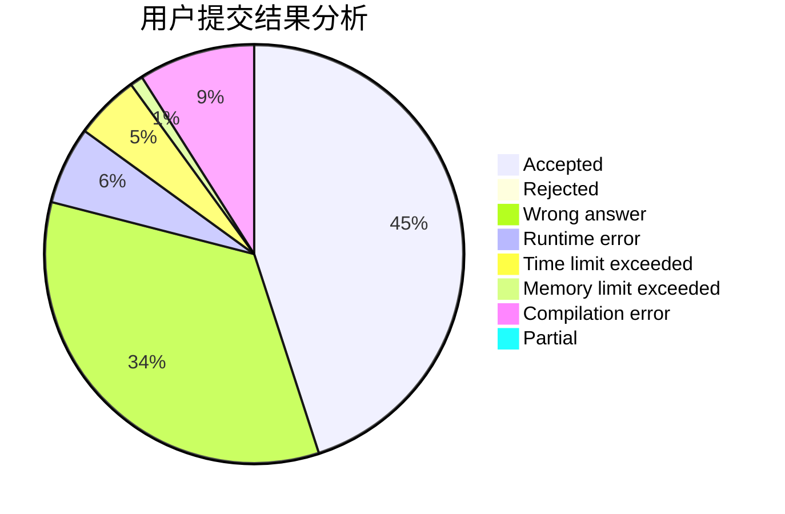
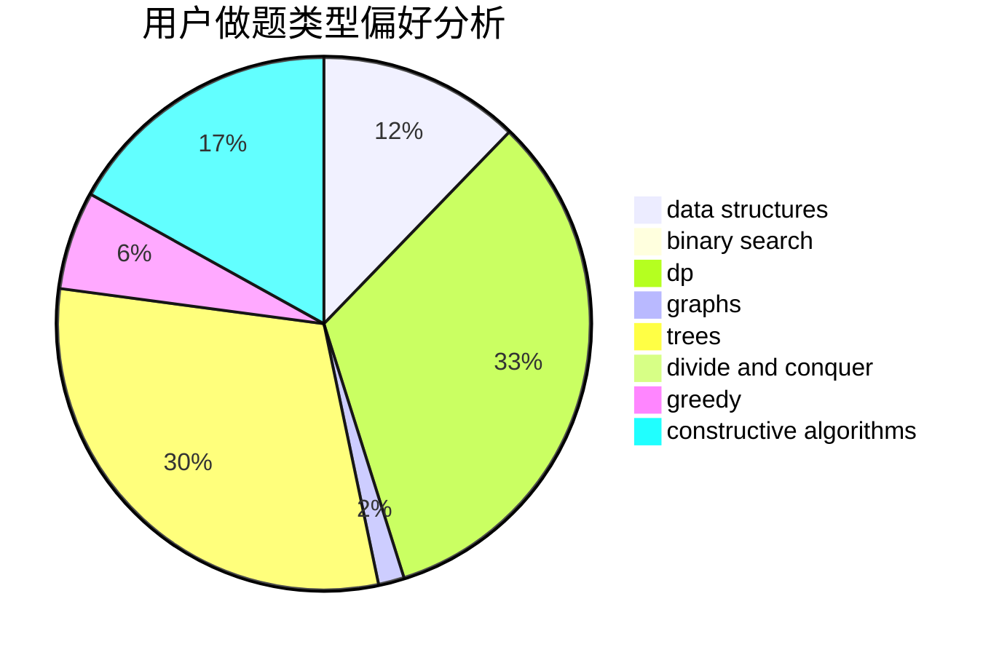
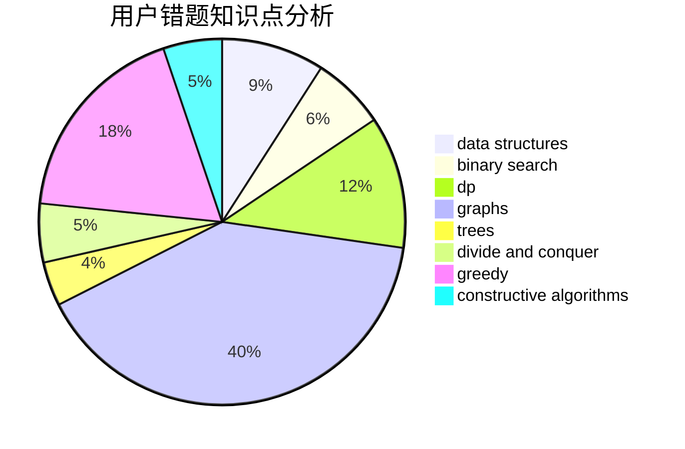

# tiger0132

<!-- tabs:start -->

#### **用户提交结果分析**

#### **用户做题类型偏好分析**

#### **用户错题知识点分析**

<!-- tabs:end -->
# 推荐题目
[952E](https://codeforces.com/contest/952/problem/E)		nan		  
[716B](https://codeforces.com/contest/716/problem/B)		greedy,
                        two pointers		  
[988C](https://codeforces.com/contest/988/problem/C)		implementation,
                        sortings		  
[1038C](https://codeforces.com/contest/1038/problem/C)		greedy,
                        sortings		  
[1297D](https://codeforces.com/contest/1297/problem/D)		*special problem,
                        binary search,
                        greedy,
                        sortings		  
[578A](https://codeforces.com/contest/578/problem/A)		geometry,
                        math		  
[627C](https://codeforces.com/contest/627/problem/C)		data structures,
                        divide and conquer,
                        greedy		  
[1145B](https://codeforces.com/contest/1145/problem/B)		brute force		  
[835D](https://codeforces.com/contest/835/problem/D)		brute force,
                        dp,
                        hashing,
                        strings		  
[1144A](https://codeforces.com/contest/1144/problem/A)		implementation,
                        strings		  
