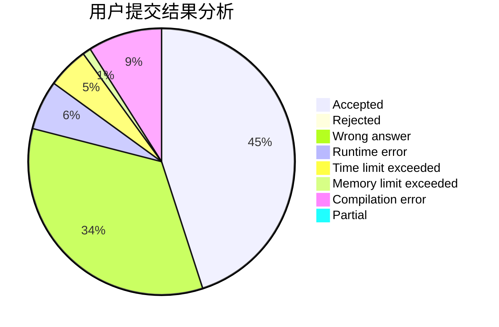
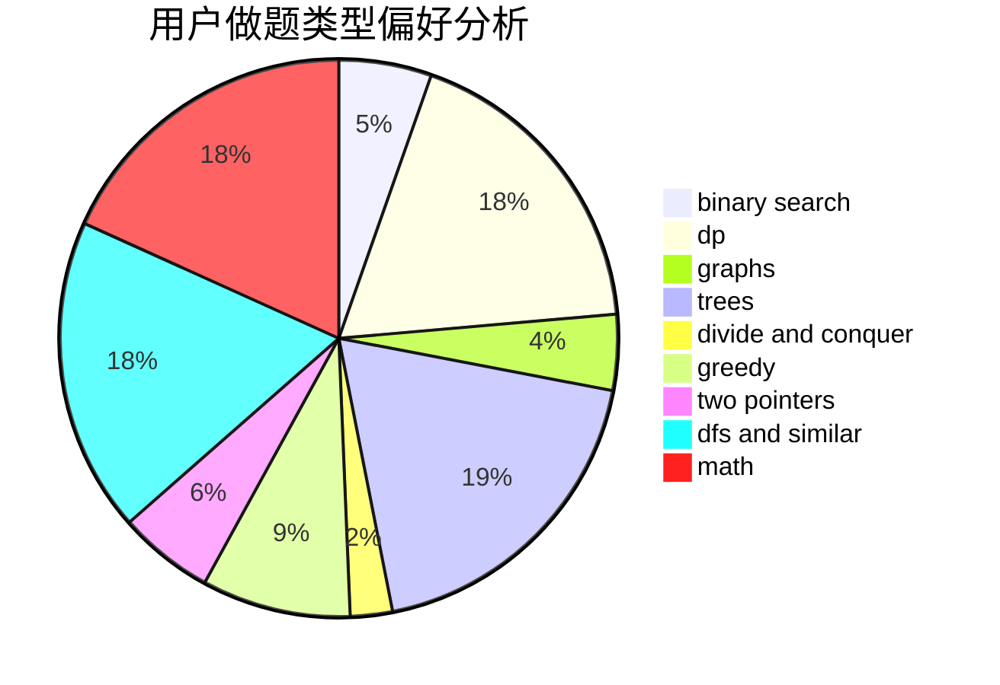

# tiger0132

<!-- tabs:start -->

#### **用户提交结果分析**

#### **用户做题类型偏好分析**

<!-- tabs:end -->
# 推荐题目
[952E](https://codeforces.com/contest/952/problem/E)
[716B](https://codeforces.com/contest/716/problem/B)
[988C](https://codeforces.com/contest/988/problem/C)
[1038C](https://codeforces.com/contest/1038/problem/C)
[1297D](https://codeforces.com/contest/1297/problem/D)
[578A](https://codeforces.com/contest/578/problem/A)
[627C](https://codeforces.com/contest/627/problem/C)
[1145B](https://codeforces.com/contest/1145/problem/B)
[835D](https://codeforces.com/contest/835/problem/D)
[1144A](https://codeforces.com/contest/1144/problem/A)
