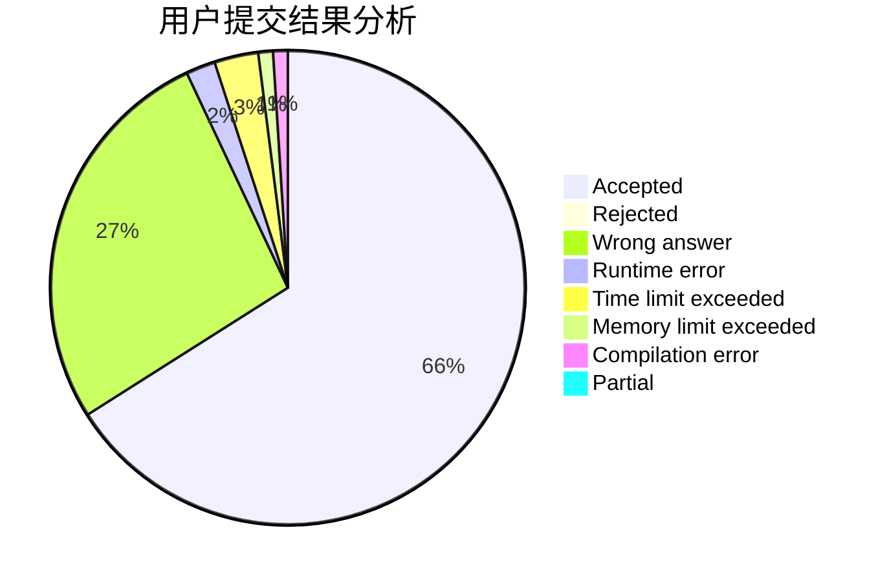
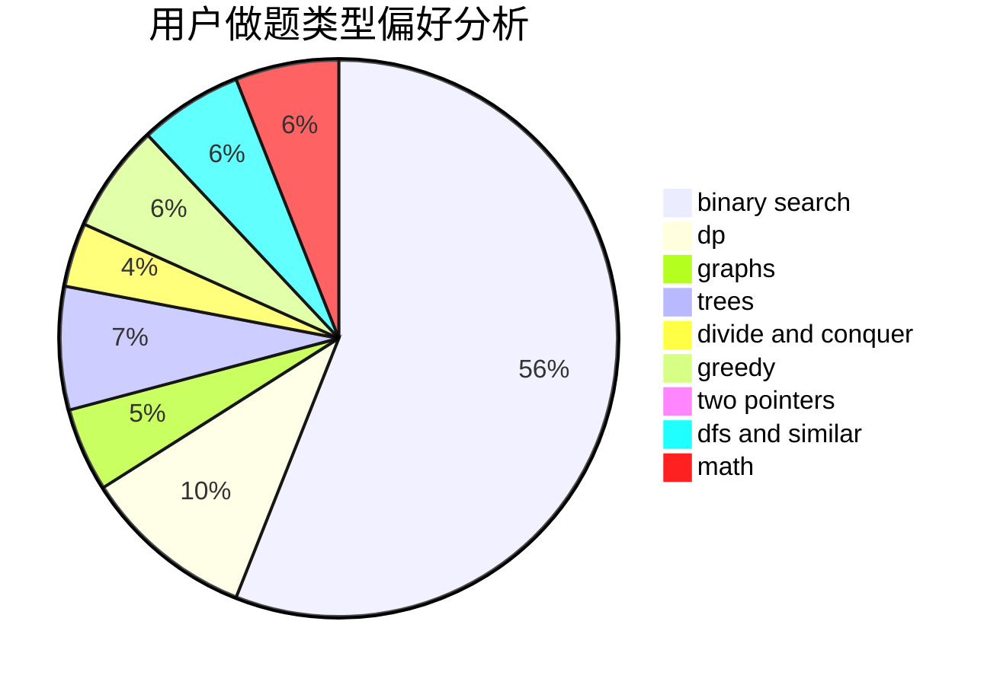

# tiger2005

<!-- tabs:start -->

#### **用户提交结果分析**

#### **用户做题类型偏好分析**

<!-- tabs:end -->
# 推荐题目
[611F](https://codeforces.com/contest/611/problem/F)
[28B](https://codeforces.com/contest/28/problem/B)
[1220C](https://codeforces.com/contest/1220/problem/C)
[1188E](https://codeforces.com/contest/1188/problem/E)
[924D](https://codeforces.com/contest/924/problem/D)
[1179B](https://codeforces.com/contest/1179/problem/B)
[12471](https://codeforces.com/contest/1247/problem/1)
[1161B](https://codeforces.com/contest/1161/problem/B)
[1164H](https://codeforces.com/contest/1164/problem/H)
[301C](https://codeforces.com/contest/301/problem/C)
