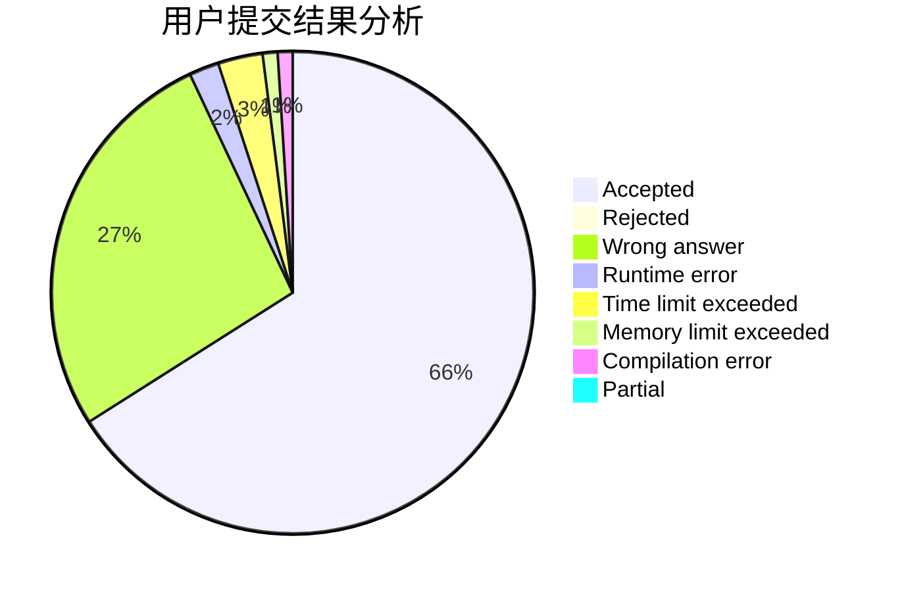
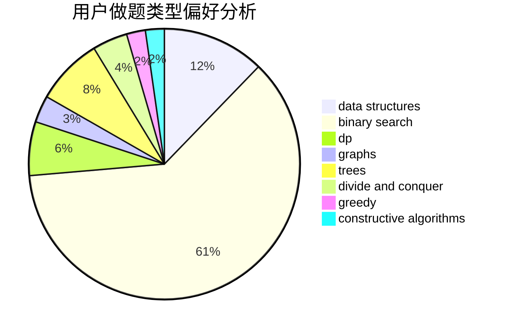

# tiger2005

<!-- tabs:start -->

#### **用户提交结果分析**

#### **用户做题类型偏好分析**

#### **用户错题知识点分析**

<!-- tabs:end -->
# 推荐题目
[611F](https://codeforces.com/contest/611/problem/F)		binary search,
                        implementation		  
[28B](https://codeforces.com/contest/28/problem/B)		dfs and similar,
                        dsu,
                        graphs		  
[1220C](https://codeforces.com/contest/1220/problem/C)		games,
                        greedy,
                        strings		  
[1188E](https://codeforces.com/contest/1188/problem/E)		combinatorics		  
[924D](https://codeforces.com/contest/924/problem/D)		nan		  
[1179B](https://codeforces.com/contest/1179/problem/B)		constructive algorithms		  
[12471](https://codeforces.com/contest/1247/problem/1)		dsu,graphs,sortings,trees		  
[1161B](https://codeforces.com/contest/1161/problem/B)		dsu,graphs,sortings,trees		  
[1164H](https://codeforces.com/contest/1164/problem/H)		dsu,graphs,sortings,trees		  
[301C](https://codeforces.com/contest/301/problem/C)		constructive algorithms		  
