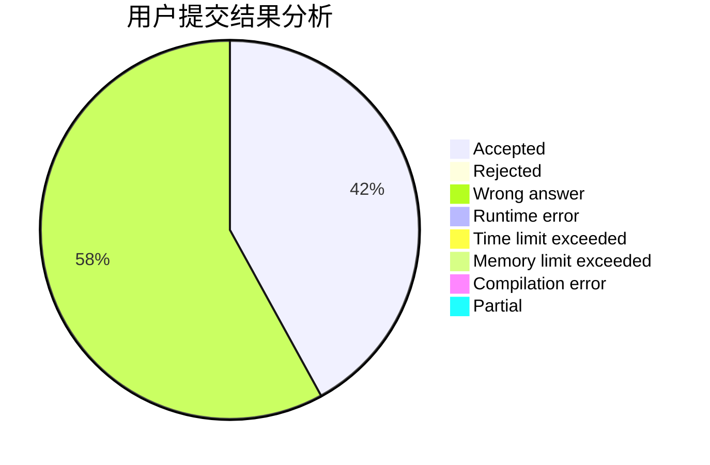
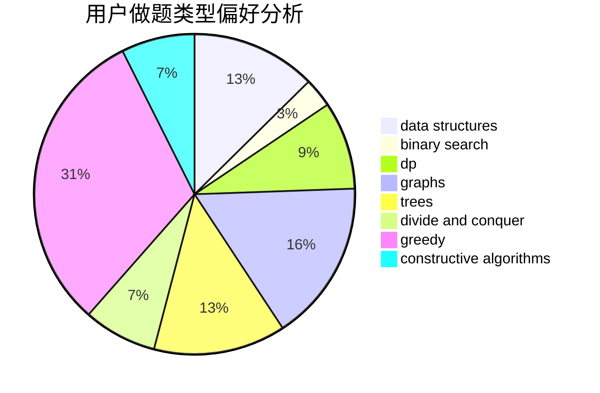
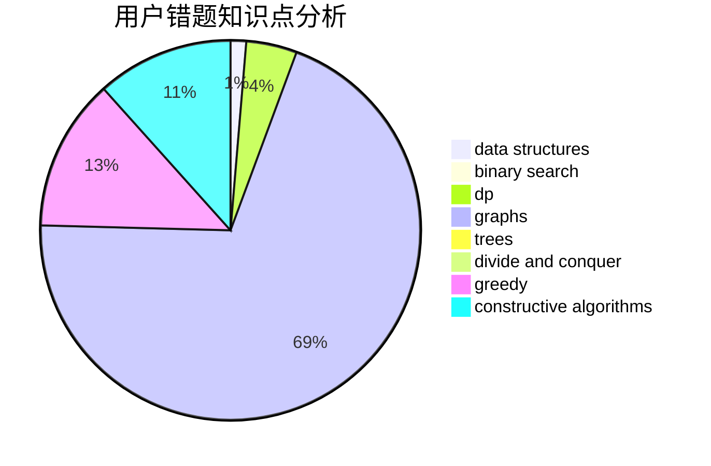

# tiinpeng

<!-- tabs:start -->

#### **用户提交结果分析**

#### **用户做题类型偏好分析**

#### **用户错题知识点分析**

<!-- tabs:end -->
# 推荐题目
[1033D](https://codeforces.com/contest/1033/problem/D)		interactive,
                        math,
                        number theory		  
[148A](https://codeforces.com/contest/148/problem/A)		constructive algorithms,
                        implementation,
                        math		  
[1301D](https://codeforces.com/contest/1301/problem/D)		constructive algorithms,
                        graphs,
                        implementation		  
[588B](https://codeforces.com/contest/588/problem/B)		math		  
[1493F](https://codeforces.com/contest/1493/problem/F)		bitmasks,
                        interactive,
                        number theory		  
[1138A](https://codeforces.com/contest/1138/problem/A)		binary search,
                        greedy,
                        implementation		  
[1204D1](https://codeforces.com/contest/1204D/problem/1)		brute force,
                        greedy,
                        strings		  
[908H](https://codeforces.com/contest/908/problem/H)		nan		  
[514B](https://codeforces.com/contest/514/problem/B)		brute force,
                        data structures,
                        geometry,
                        implementation,
                        math		  
[289D](https://codeforces.com/contest/289/problem/D)		dsu,graphs,sortings,trees		  
