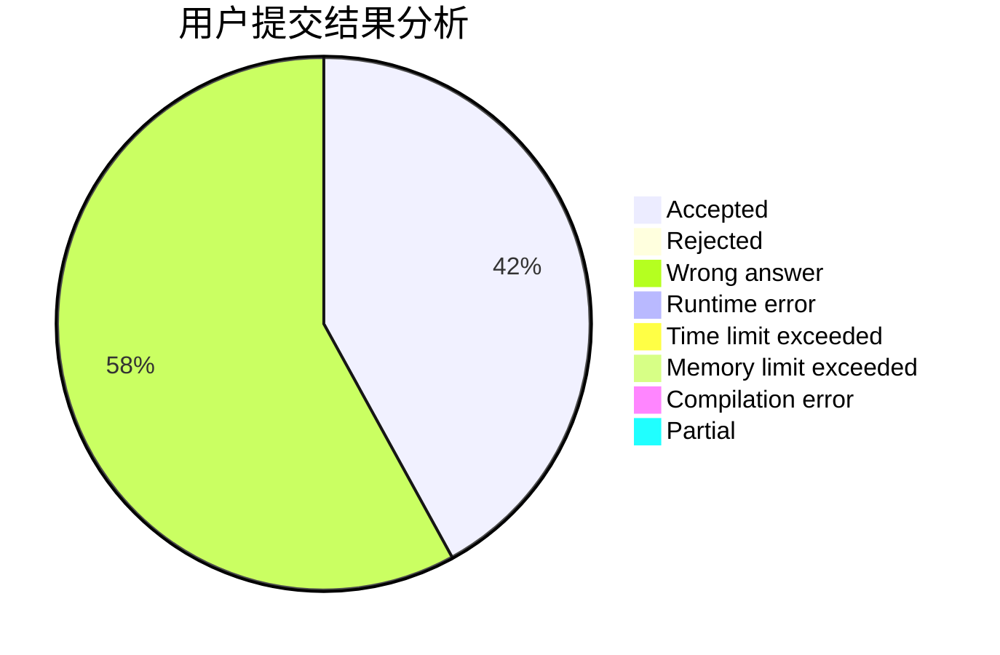
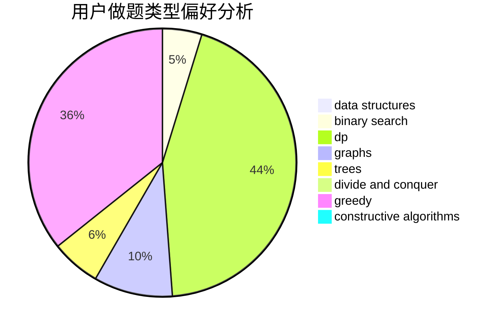
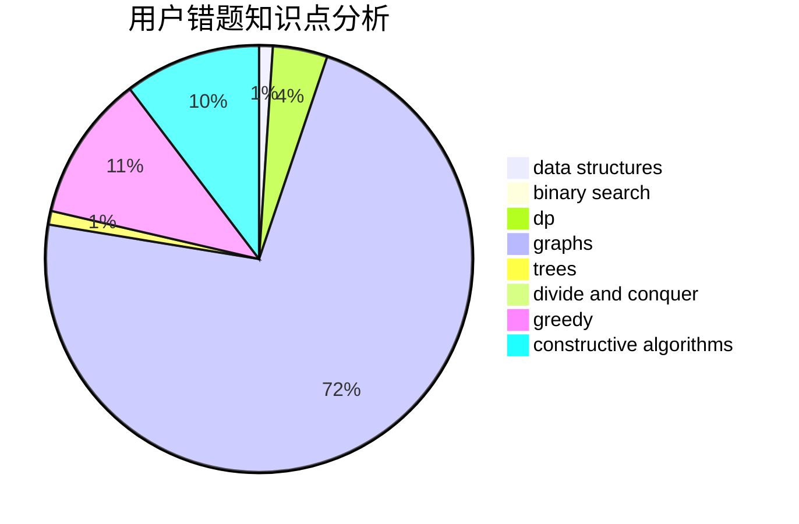

# tiinpeng

<!-- tabs:start -->

#### **用户提交结果分析**

#### **用户做题类型偏好分析**

#### **用户错题知识点分析**

<!-- tabs:end -->
# 推荐题目
[1033G](https://codeforces.com/contest/1033/problem/G)		games		  
[1498C](https://codeforces.com/contest/1498/problem/C)		brute force,
                        data structures,
                        dp		  
[1311A](https://codeforces.com/contest/1311/problem/A)		greedy,
                        implementation,
                        math		  
[608D](https://codeforces.com/contest/608/problem/D)		dsu,graphs,sortings,trees		  
[1501F](https://codeforces.com/contest/1501/problem/F)		dsu,graphs,sortings,trees		  
[113C](https://codeforces.com/contest/113/problem/C)		brute force,
                        math,
                        number theory		  
[12092](https://codeforces.com/contest/1209/problem/2)		dsu,graphs,sortings,trees		  
[923C](https://codeforces.com/contest/923/problem/C)		data structures,
                        greedy,
                        strings,
                        trees		  
[53E](https://codeforces.com/contest/53/problem/E)		bitmasks,
                        dp		  
[303C](https://codeforces.com/contest/303/problem/C)		brute force,
                        graphs,
                        math,
                        number theory		  
