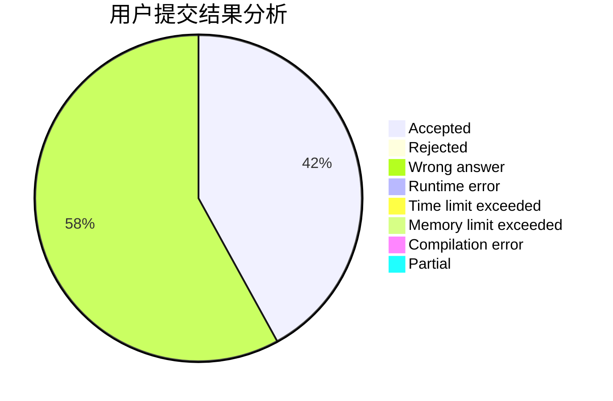
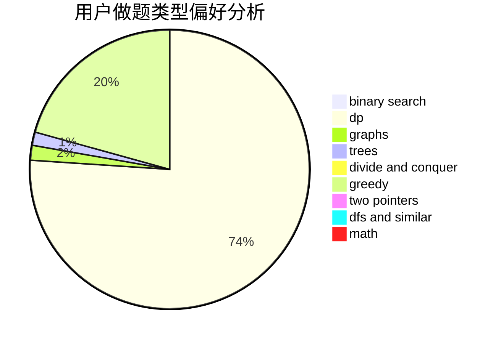

# tiinpeng

<!-- tabs:start -->

#### **用户提交结果分析**

#### **用户做题类型偏好分析**

<!-- tabs:end -->
# 推荐题目
[1033G](https://codeforces.com/contest/1033/problem/G)
[1498C](https://codeforces.com/contest/1498/problem/C)
[1311A](https://codeforces.com/contest/1311/problem/A)
[608D](https://codeforces.com/contest/608/problem/D)
[1501F](https://codeforces.com/contest/1501/problem/F)
[113C](https://codeforces.com/contest/113/problem/C)
[12092](https://codeforces.com/contest/1209/problem/2)
[923C](https://codeforces.com/contest/923/problem/C)
[53E](https://codeforces.com/contest/53/problem/E)
[303C](https://codeforces.com/contest/303/problem/C)
