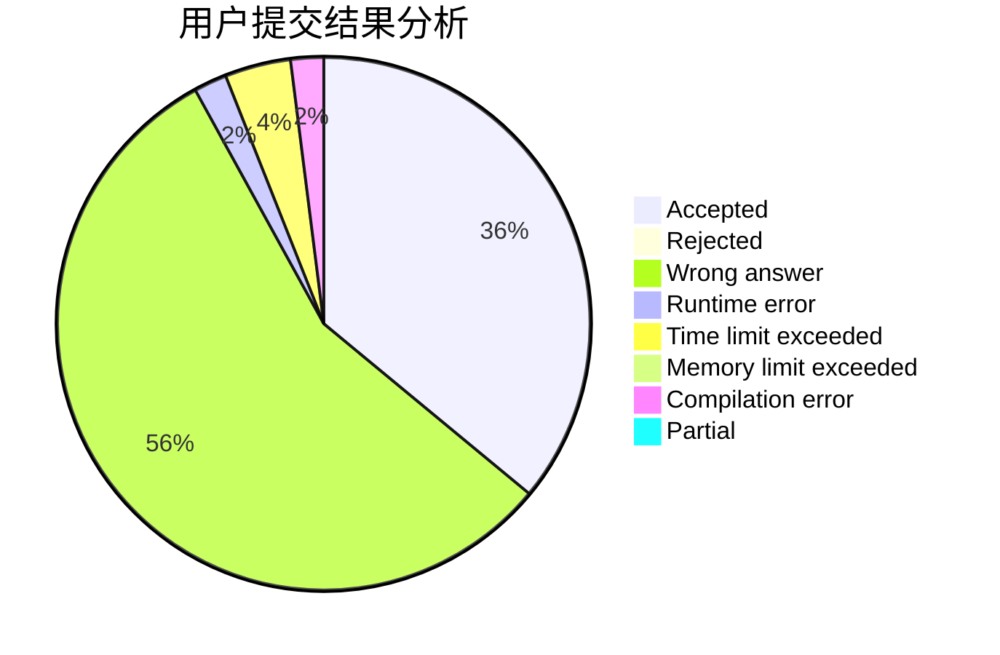
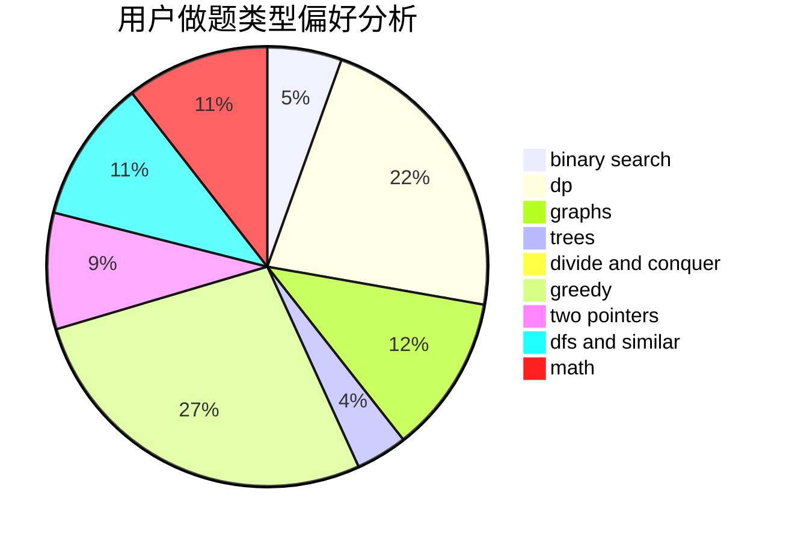

# timber3252

<!-- tabs:start -->

#### **用户提交结果分析**

#### **用户做题类型偏好分析**

<!-- tabs:end -->
# 推荐题目
[448B](https://codeforces.com/contest/448/problem/B)
[317A](https://codeforces.com/contest/317/problem/A)
[386C](https://codeforces.com/contest/386/problem/C)
[1088F](https://codeforces.com/contest/1088/problem/F)
[855F](https://codeforces.com/contest/855/problem/F)
[607E](https://codeforces.com/contest/607/problem/E)
[676C](https://codeforces.com/contest/676/problem/C)
[987F](https://codeforces.com/contest/987/problem/F)
[883A](https://codeforces.com/contest/883/problem/A)
[1217B](https://codeforces.com/contest/1217/problem/B)
