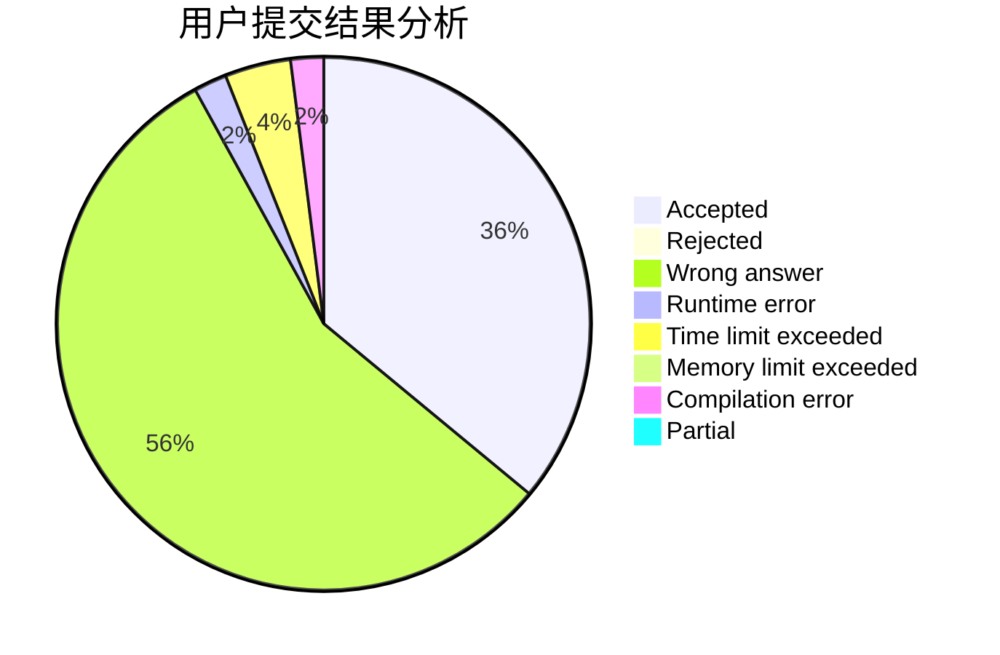
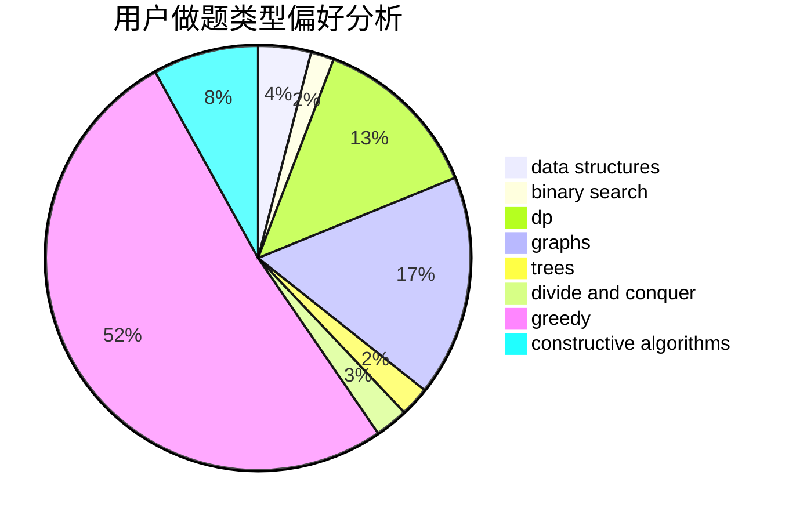
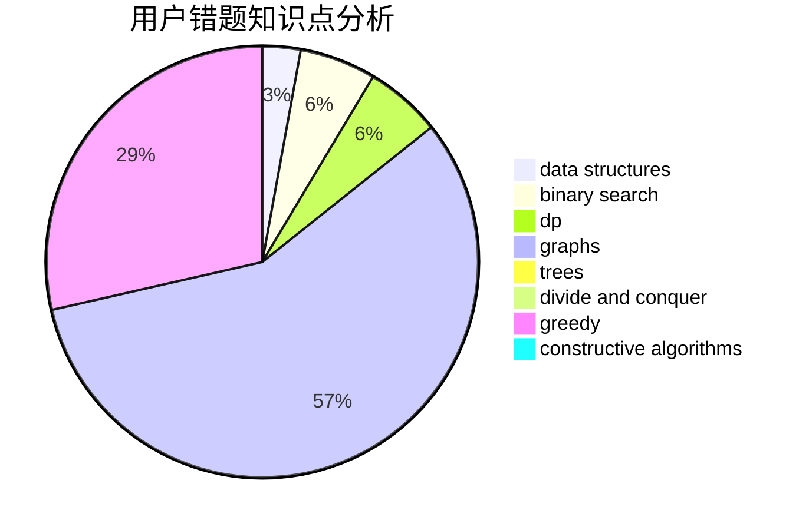

# timber3252

<!-- tabs:start -->

#### **用户提交结果分析**

#### **用户做题类型偏好分析**

#### **用户错题知识点分析**

<!-- tabs:end -->
# 推荐题目
[424E](https://codeforces.com/contest/424/problem/E)		dfs and similar,
                        dp,
                        probabilities		  
[29B](https://codeforces.com/contest/29/problem/B)		implementation		  
[359C](https://codeforces.com/contest/359/problem/C)		math,
                        number theory		  
[1088C](https://codeforces.com/contest/1088/problem/C)		constructive algorithms,
                        greedy,
                        math		  
[838A](https://codeforces.com/contest/838/problem/A)		brute force		  
[587D](https://codeforces.com/contest/587/problem/D)		2-sat,
                        binary search		  
[652D](https://codeforces.com/contest/652/problem/D)		data structures,
                        sortings		  
[966A](https://codeforces.com/contest/966/problem/A)		dsu,graphs,sortings,trees		  
[862D](https://codeforces.com/contest/862/problem/D)		binary search,
                        divide and conquer,
                        interactive		  
[1211B](https://codeforces.com/contest/1211/problem/B)		*special problem,
                        implementation		  
