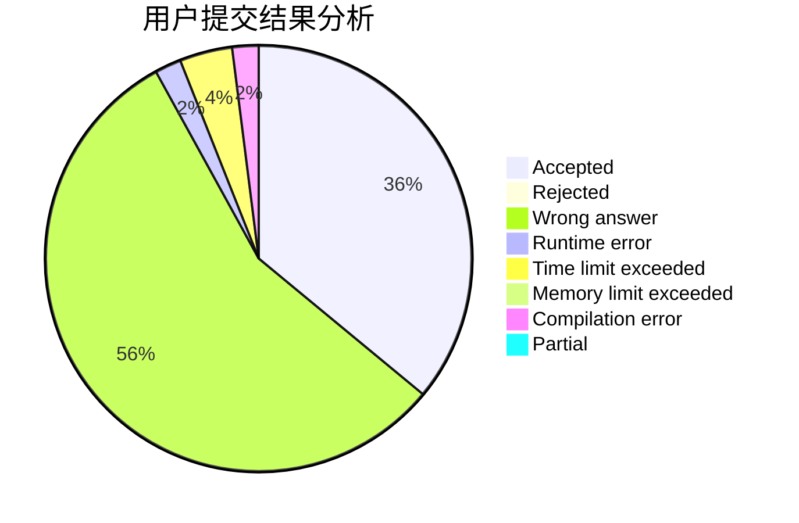
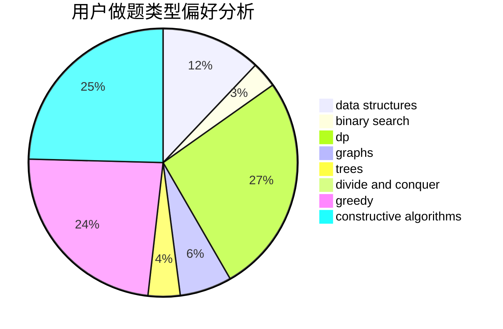
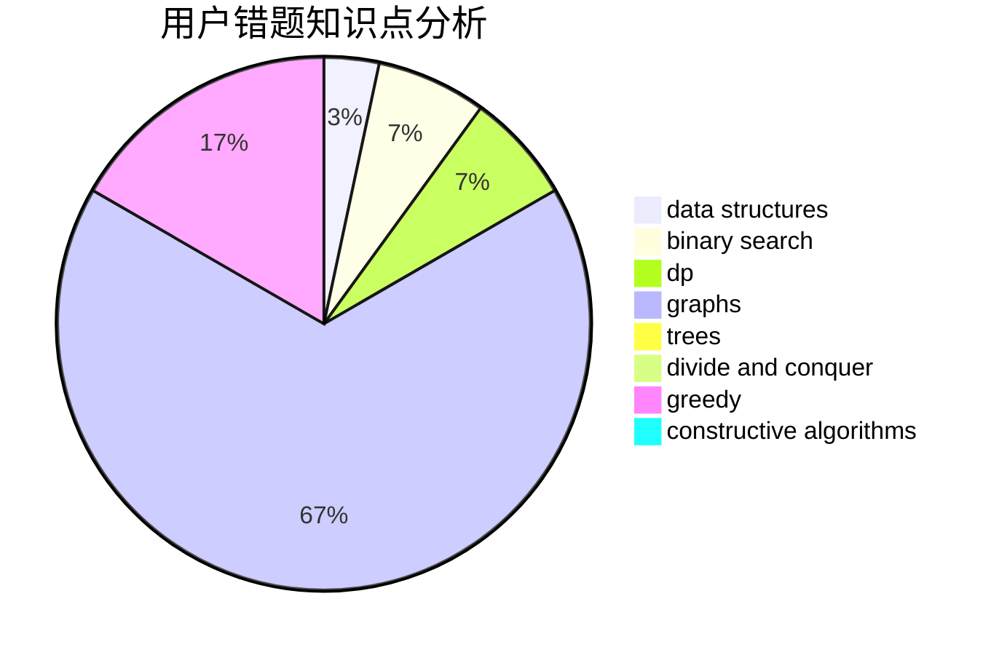

# timber3252

<!-- tabs:start -->

#### **用户提交结果分析**

#### **用户做题类型偏好分析**

#### **用户错题知识点分析**

<!-- tabs:end -->
# 推荐题目
[448B](https://codeforces.com/contest/448/problem/B)		implementation,
                        strings		  
[317A](https://codeforces.com/contest/317/problem/A)		brute force		  
[386C](https://codeforces.com/contest/386/problem/C)		dp,
                        strings,
                        two pointers		  
[1088F](https://codeforces.com/contest/1088/problem/F)		data structures,
                        trees		  
[855F](https://codeforces.com/contest/855/problem/F)		binary search,
                        data structures		  
[607E](https://codeforces.com/contest/607/problem/E)		binary search,
                        geometry		  
[676C](https://codeforces.com/contest/676/problem/C)		binary search,
                        dp,
                        strings,
                        two pointers		  
[987F](https://codeforces.com/contest/987/problem/F)		dsu,graphs,sortings,trees		  
[883A](https://codeforces.com/contest/883/problem/A)		implementation		  
[1217B](https://codeforces.com/contest/1217/problem/B)		greedy,
                        math		  
