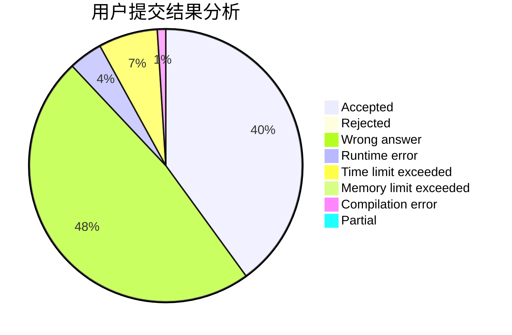
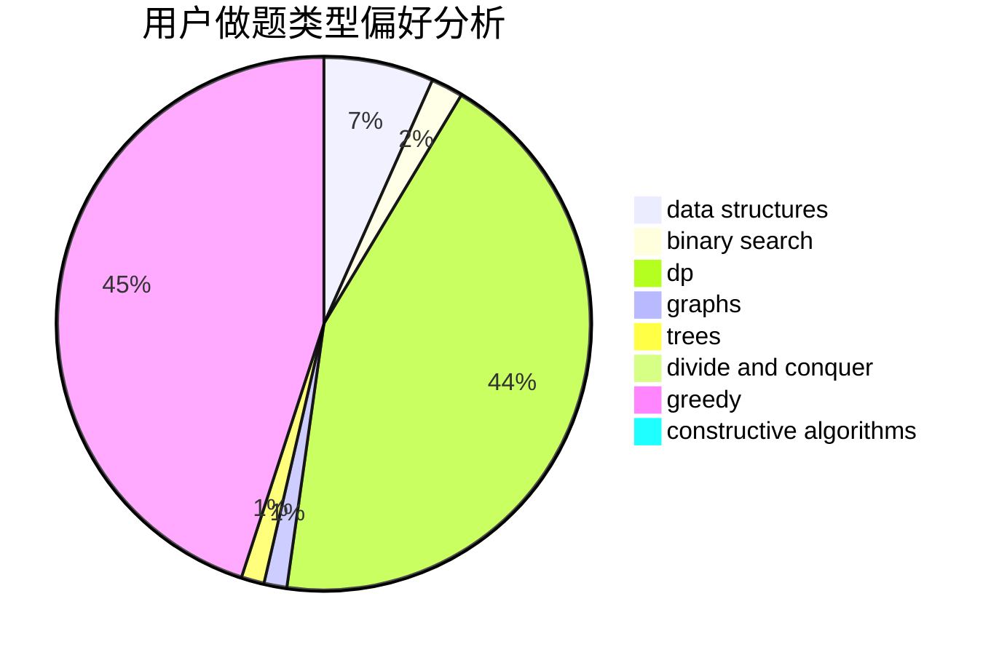
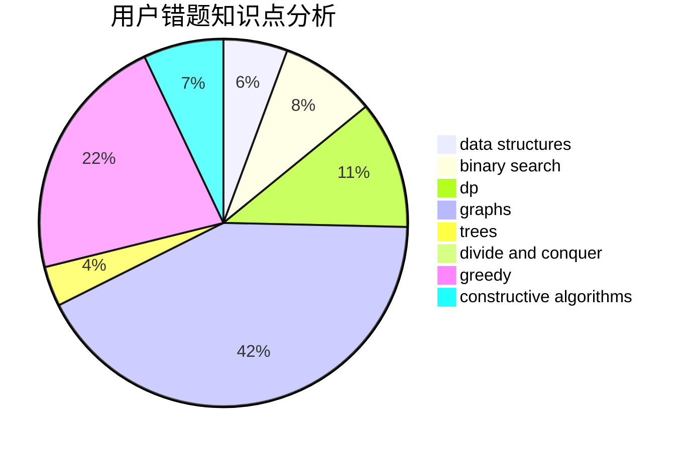

# timeguy

<!-- tabs:start -->

#### **用户提交结果分析**

#### **用户做题类型偏好分析**

#### **用户错题知识点分析**

<!-- tabs:end -->
# 推荐题目
[1282C](https://codeforces.com/contest/1282/problem/C)		greedy,
                        sortings,
                        two pointers		  
[716A](https://codeforces.com/contest/716/problem/A)		implementation		  
[433B](https://codeforces.com/contest/433/problem/B)		dp,
                        implementation,
                        sortings		  
[268A](https://codeforces.com/contest/268/problem/A)		brute force		  
[620B](https://codeforces.com/contest/620/problem/B)		implementation		  
[1276D](https://codeforces.com/contest/1276/problem/D)		dp,
                        trees		  
[976A](https://codeforces.com/contest/976/problem/A)		implementation		  
[784G](https://codeforces.com/contest/784/problem/G)		*special problem		  
[335A](https://codeforces.com/contest/335/problem/A)		binary search,
                        constructive algorithms,
                        greedy		  
[297A](https://codeforces.com/contest/297/problem/A)		constructive algorithms		  
