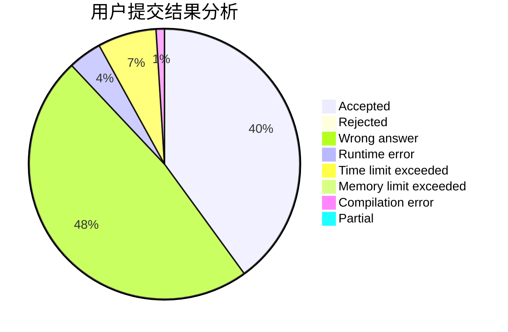
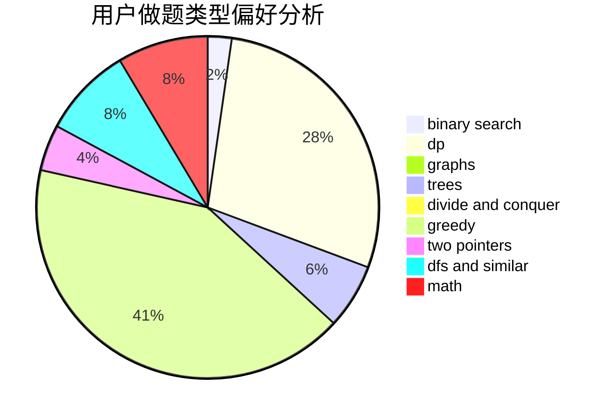

# timeguy

<!-- tabs:start -->

#### **用户提交结果分析**

#### **用户做题类型偏好分析**

<!-- tabs:end -->
# 推荐题目
[1282C](https://codeforces.com/contest/1282/problem/C)
[716A](https://codeforces.com/contest/716/problem/A)
[433B](https://codeforces.com/contest/433/problem/B)
[268A](https://codeforces.com/contest/268/problem/A)
[620B](https://codeforces.com/contest/620/problem/B)
[1276D](https://codeforces.com/contest/1276/problem/D)
[976A](https://codeforces.com/contest/976/problem/A)
[784G](https://codeforces.com/contest/784/problem/G)
[335A](https://codeforces.com/contest/335/problem/A)
[297A](https://codeforces.com/contest/297/problem/A)
