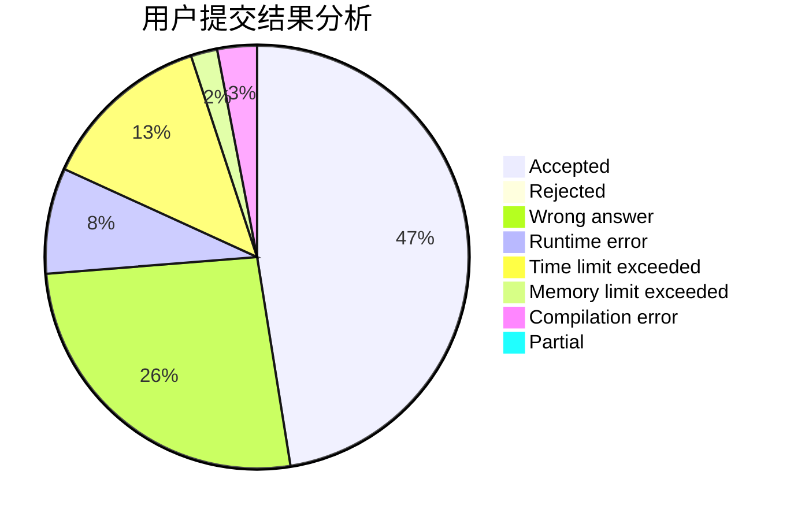
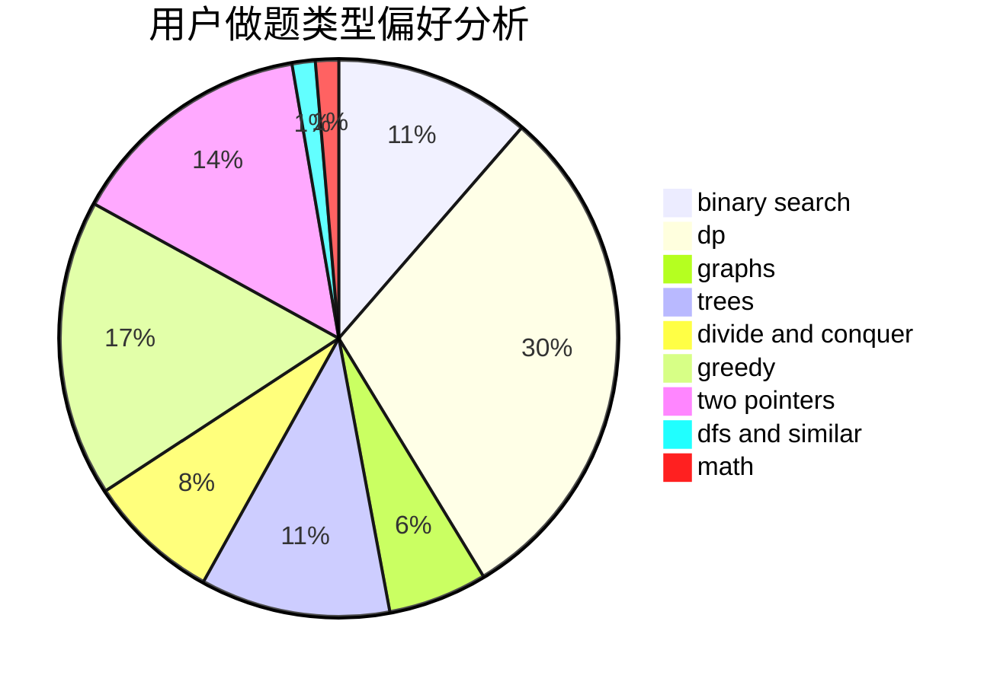

# CTP_314

<!-- tabs:start -->

#### **用户提交结果分析**

#### **用户做题类型偏好分析**

<!-- tabs:end -->
# 推荐题目
[485A](https://codeforces.com/contest/485/problem/A)
[1063B](https://codeforces.com/contest/1063/problem/B)
[378B](https://codeforces.com/contest/378/problem/B)
[1246D](https://codeforces.com/contest/1246/problem/D)
[635A](https://codeforces.com/contest/635/problem/A)
[1244G](https://codeforces.com/contest/1244/problem/G)
[14792](https://codeforces.com/contest/1479/problem/2)
[1062D](https://codeforces.com/contest/1062/problem/D)
[1244E](https://codeforces.com/contest/1244/problem/E)
[1245F](https://codeforces.com/contest/1245/problem/F)
