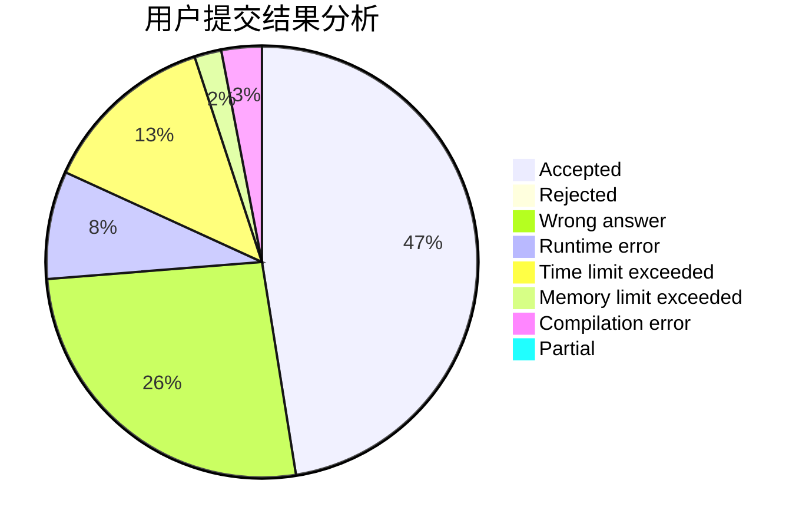
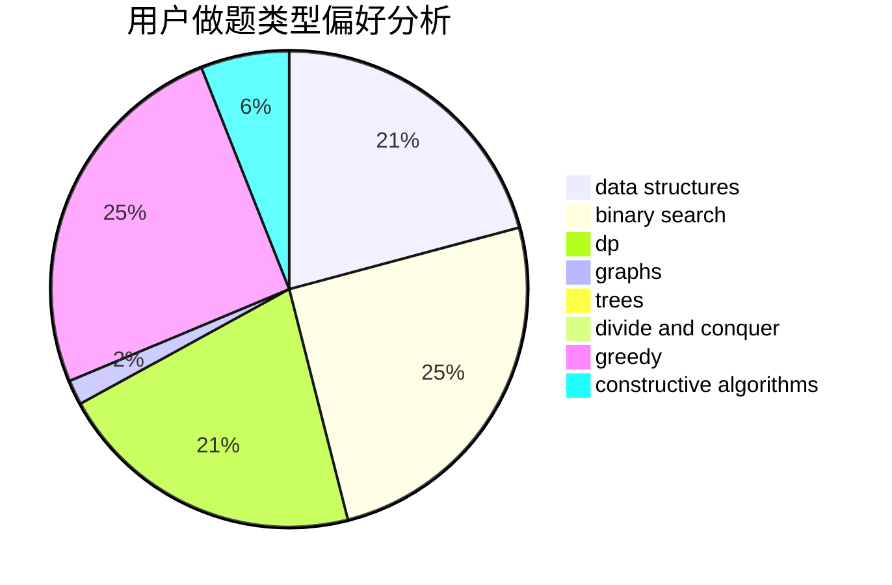
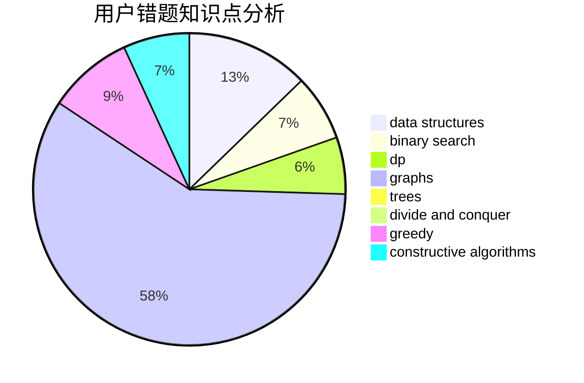

# CTP_314

<!-- tabs:start -->

#### **用户提交结果分析**

#### **用户做题类型偏好分析**

#### **用户错题知识点分析**

<!-- tabs:end -->
# 推荐题目
[466A](https://codeforces.com/contest/466/problem/A)		implementation		  
[1062E](https://codeforces.com/contest/1062/problem/E)		binary search,
                        data structures,
                        dfs and similar,
                        greedy,
                        trees		  
[351E](https://codeforces.com/contest/351/problem/E)		greedy		  
[1241A](https://codeforces.com/contest/1241/problem/A)		dsu,graphs,sortings,trees		  
[617B](https://codeforces.com/contest/617/problem/B)		combinatorics		  
[1239E](https://codeforces.com/contest/1239/problem/E)		dp,
                        implementation		  
[1470E](https://codeforces.com/contest/1470/problem/E)		binary search,
                        combinatorics,
                        data structures,
                        dp,
                        graphs,
                        implementation,
                        two pointers		  
[1062A](https://codeforces.com/contest/1062/problem/A)		greedy,
                        implementation		  
[1239C](https://codeforces.com/contest/1239/problem/C)		data structures,
                        greedy,
                        implementation		  
[1240C](https://codeforces.com/contest/1240/problem/C)		dsu,graphs,sortings,trees		  
