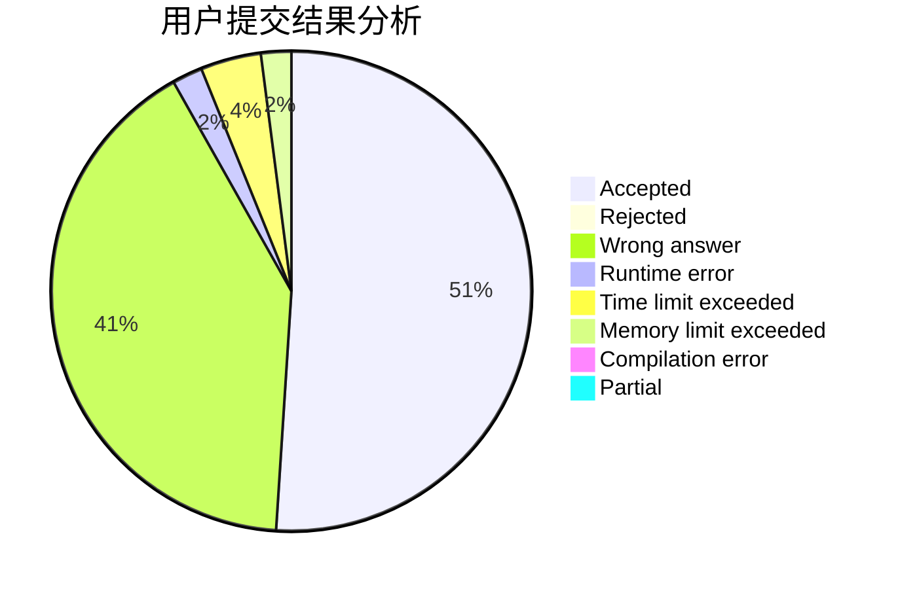
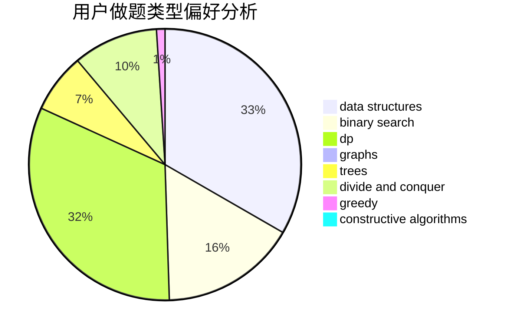
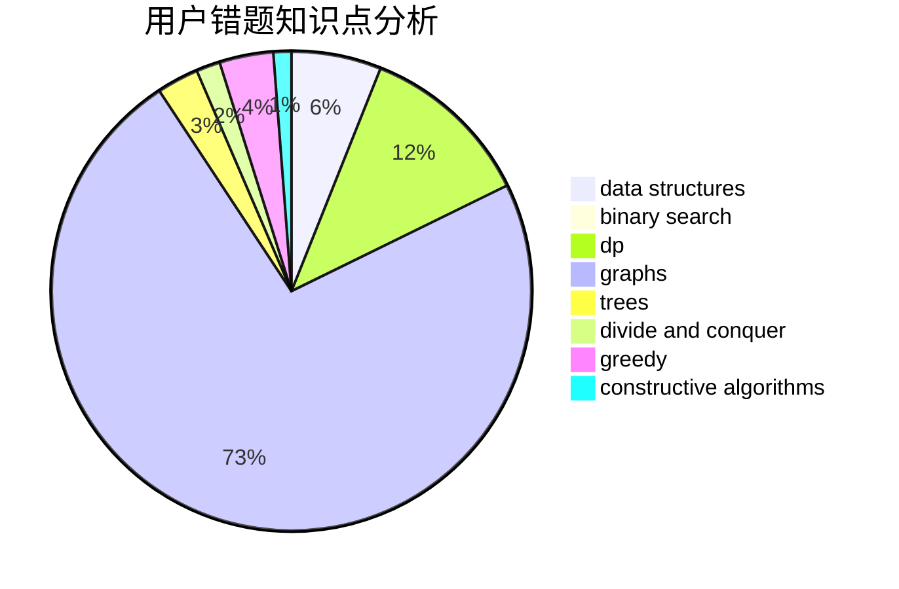

# tingyichen

<!-- tabs:start -->

#### **用户提交结果分析**

#### **用户做题类型偏好分析**

#### **用户错题知识点分析**

<!-- tabs:end -->
# 推荐题目
[897B](https://codeforces.com/contest/897/problem/B)		brute force		  
[859F](https://codeforces.com/contest/859/problem/F)		greedy		  
[364C](https://codeforces.com/contest/364/problem/C)		brute force,
                        number theory		  
[954C](https://codeforces.com/contest/954/problem/C)		implementation		  
[1244D](https://codeforces.com/contest/1244/problem/D)		brute force,
                        constructive algorithms,
                        dp,
                        graphs,
                        implementation,
                        trees		  
[1036D](https://codeforces.com/contest/1036/problem/D)		greedy,
                        two pointers		  
[1353C](https://codeforces.com/contest/1353/problem/C)		math		  
[1423B](https://codeforces.com/contest/1423/problem/B)		binary search,
                        flows,
                        graph matchings,
                        graphs		  
[477B](https://codeforces.com/contest/477/problem/B)		dsu,graphs,sortings,trees		  
[1459B](https://codeforces.com/contest/1459/problem/B)		dp,
                        math		  
