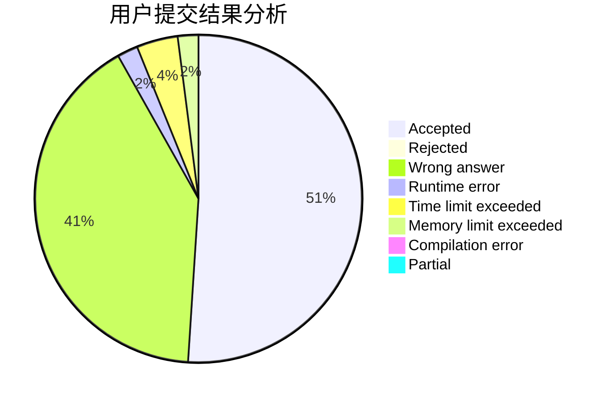
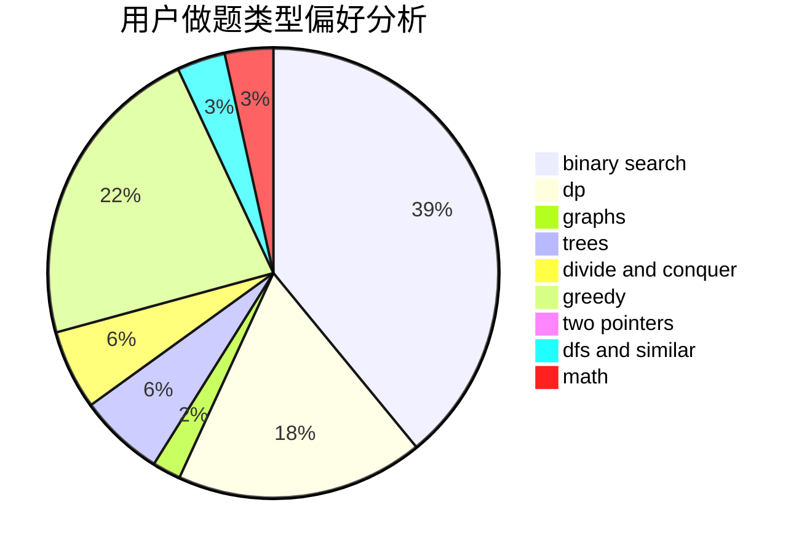

# tingyichen

<!-- tabs:start -->

#### **用户提交结果分析**

#### **用户做题类型偏好分析**

<!-- tabs:end -->
# 推荐题目
[914A](https://codeforces.com/contest/914/problem/A)
[877C](https://codeforces.com/contest/877/problem/C)
[3912](https://codeforces.com/contest/391/problem/2)
[976B](https://codeforces.com/contest/976/problem/B)
[1249F](https://codeforces.com/contest/1249/problem/F)
[1037A](https://codeforces.com/contest/1037/problem/A)
[1360A](https://codeforces.com/contest/1360/problem/A)
[1430E](https://codeforces.com/contest/1430/problem/E)
[497B](https://codeforces.com/contest/497/problem/B)
[1468B](https://codeforces.com/contest/1468/problem/B)
