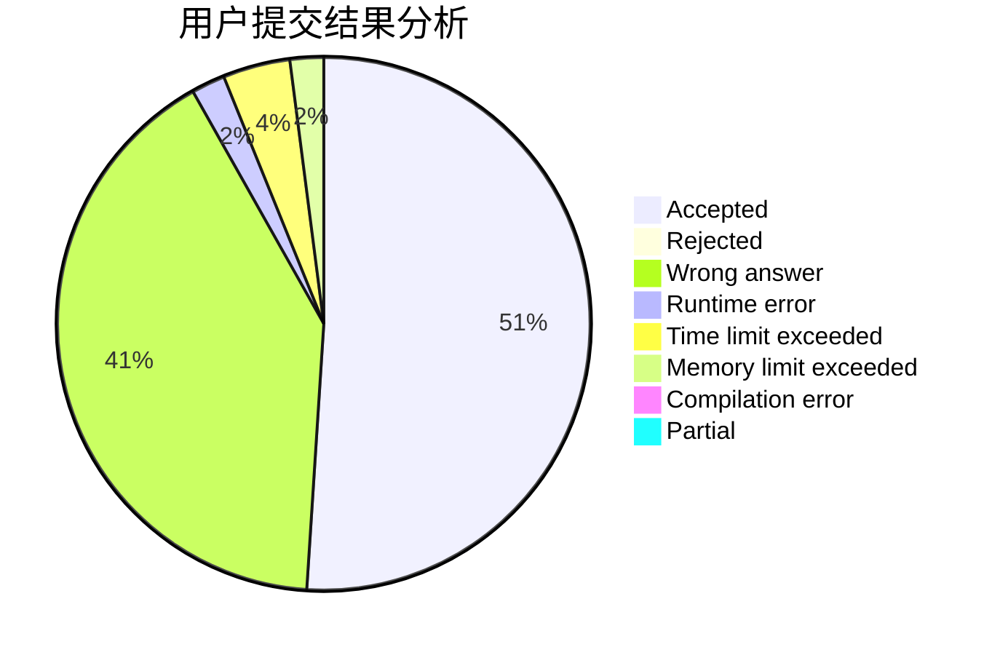
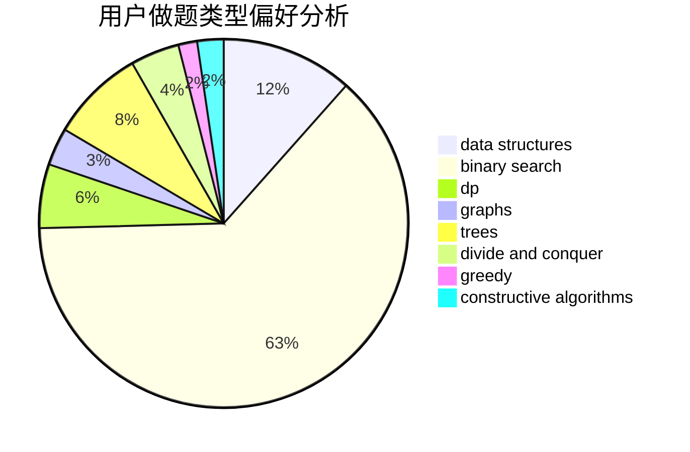
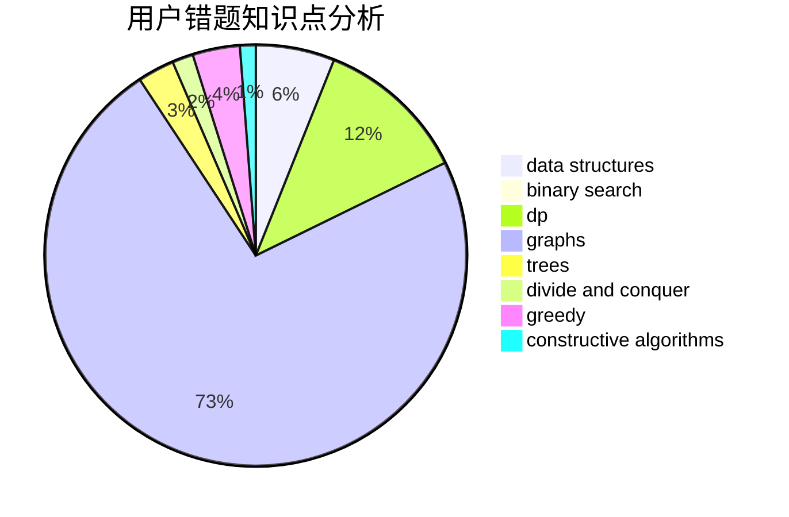

# tingyichen

<!-- tabs:start -->

#### **用户提交结果分析**

#### **用户做题类型偏好分析**

#### **用户错题知识点分析**

<!-- tabs:end -->
# 推荐题目
[914A](https://codeforces.com/contest/914/problem/A)		brute force,
                        implementation,
                        math		  
[877C](https://codeforces.com/contest/877/problem/C)		constructive algorithms		  
[3912](https://codeforces.com/contest/391/problem/2)		dsu,graphs,sortings,trees		  
[976B](https://codeforces.com/contest/976/problem/B)		implementation,
                        math		  
[1249F](https://codeforces.com/contest/1249/problem/F)		dp,
                        trees		  
[1037A](https://codeforces.com/contest/1037/problem/A)		constructive algorithms,
                        greedy,
                        math		  
[1360A](https://codeforces.com/contest/1360/problem/A)		greedy,
                        math		  
[1430E](https://codeforces.com/contest/1430/problem/E)		data structures,
                        greedy,
                        strings		  
[497B](https://codeforces.com/contest/497/problem/B)		dsu,graphs,sortings,trees		  
[1468B](https://codeforces.com/contest/1468/problem/B)		data structures,
                        dsu		  
