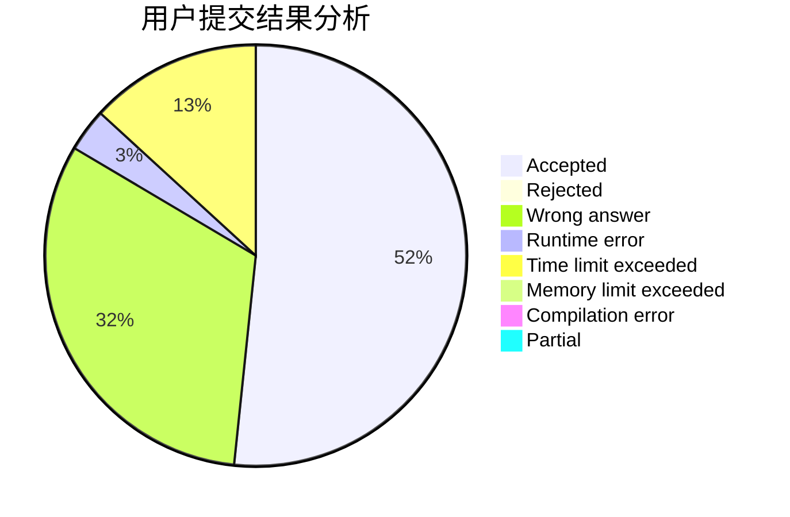
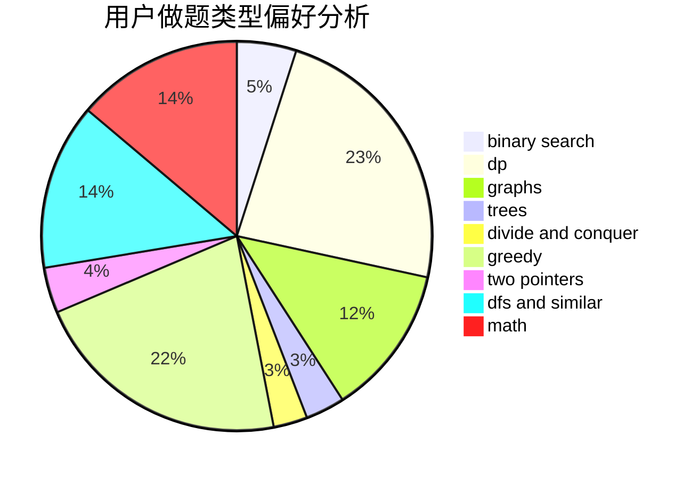

# tinyme

<!-- tabs:start -->

#### **用户提交结果分析**

#### **用户做题类型偏好分析**

<!-- tabs:end -->
# 推荐题目
[1395B](https://codeforces.com/contest/1395/problem/B)
[579A](https://codeforces.com/contest/579/problem/A)
[1131D](https://codeforces.com/contest/1131/problem/D)
[280E](https://codeforces.com/contest/280/problem/E)
[1264C](https://codeforces.com/contest/1264/problem/C)
[849A](https://codeforces.com/contest/849/problem/A)
[1096D](https://codeforces.com/contest/1096/problem/D)
[864D](https://codeforces.com/contest/864/problem/D)
[1167E](https://codeforces.com/contest/1167/problem/E)
[632B](https://codeforces.com/contest/632/problem/B)
