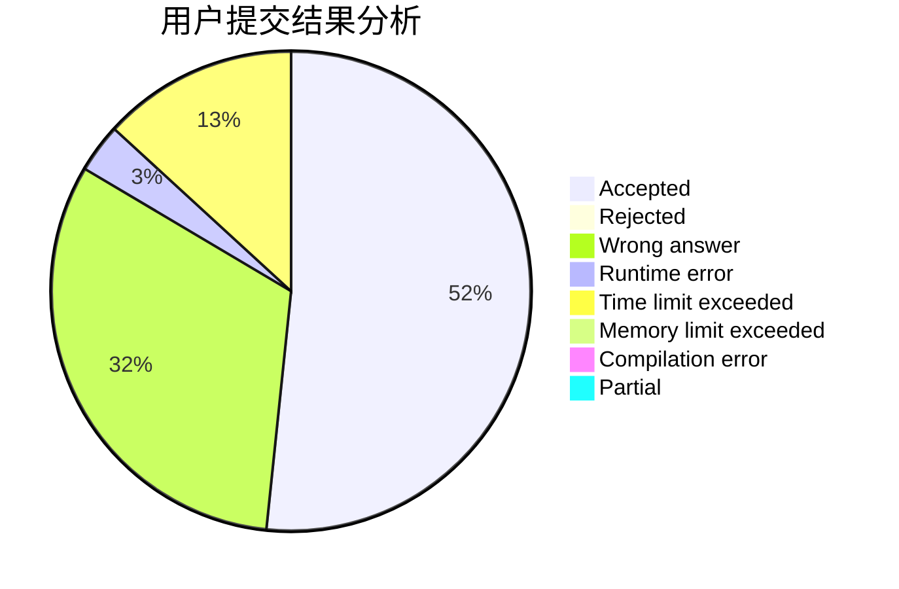
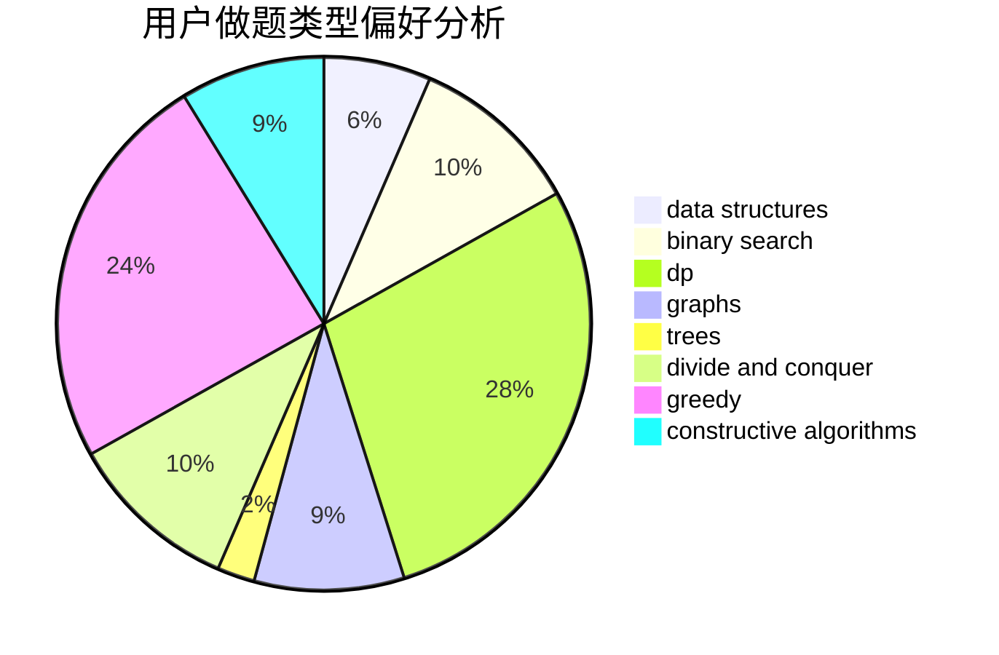
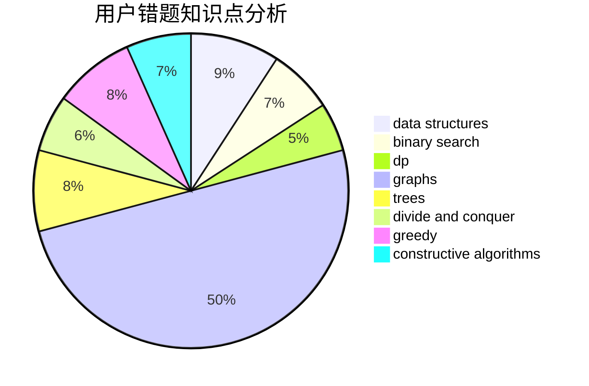

# tinyme

<!-- tabs:start -->

#### **用户提交结果分析**

#### **用户做题类型偏好分析**

#### **用户错题知识点分析**

<!-- tabs:end -->
# 推荐题目
[1395B](https://codeforces.com/contest/1395/problem/B)		constructive algorithms		  
[579A](https://codeforces.com/contest/579/problem/A)		bitmasks		  
[1131D](https://codeforces.com/contest/1131/problem/D)		dfs and similar,
                        dp,
                        dsu,
                        graphs,
                        greedy		  
[280E](https://codeforces.com/contest/280/problem/E)		data structures,
                        dp,
                        implementation,
                        math		  
[1264C](https://codeforces.com/contest/1264/problem/C)		data structures,
                        probabilities		  
[849A](https://codeforces.com/contest/849/problem/A)		implementation		  
[1096D](https://codeforces.com/contest/1096/problem/D)		dp		  
[864D](https://codeforces.com/contest/864/problem/D)		greedy,
                        implementation,
                        math		  
[1167E](https://codeforces.com/contest/1167/problem/E)		binary search,
                        combinatorics,
                        data structures,
                        two pointers		  
[632B](https://codeforces.com/contest/632/problem/B)		brute force,
                        constructive algorithms		  
