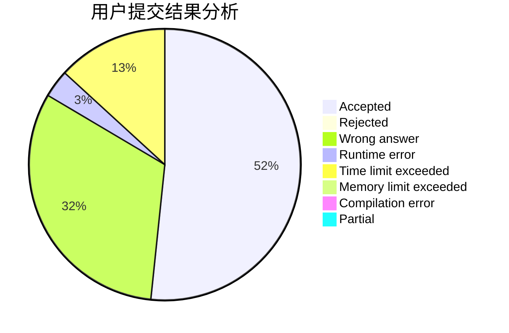
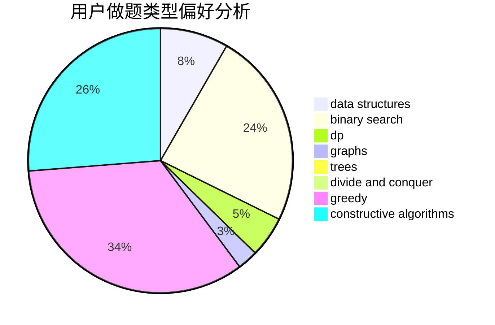
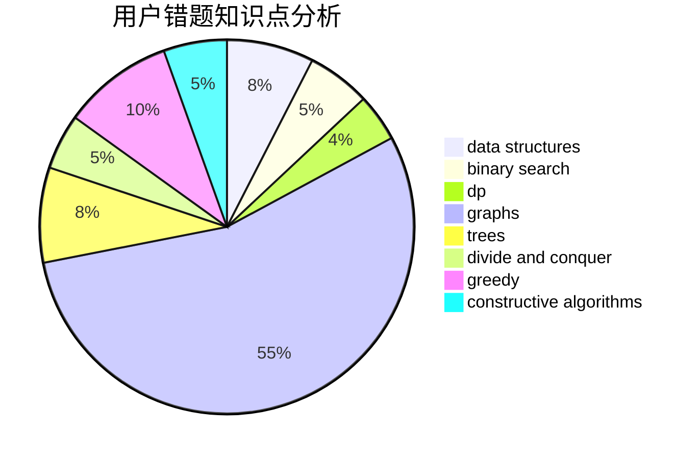

# tinyme

<!-- tabs:start -->

#### **用户提交结果分析**

#### **用户做题类型偏好分析**

#### **用户错题知识点分析**

<!-- tabs:end -->
# 推荐题目
[1385B](https://codeforces.com/contest/1385/problem/B)		greedy		  
[553E](https://codeforces.com/contest/553/problem/E)		dp,
                        fft,
                        graphs,
                        math,
                        probabilities		  
[1129D](https://codeforces.com/contest/1129/problem/D)		data structures,
                        dp		  
[264E](https://codeforces.com/contest/264/problem/E)		data structures,
                        dp		  
[1257C](https://codeforces.com/contest/1257/problem/C)		greedy,
                        implementation,
                        sortings,
                        strings,
                        two pointers		  
[831A](https://codeforces.com/contest/831/problem/A)		implementation		  
[1096A](https://codeforces.com/contest/1096/problem/A)		greedy,
                        implementation,
                        math		  
[846B](https://codeforces.com/contest/846/problem/B)		brute force,
                        greedy		  
[1165C](https://codeforces.com/contest/1165/problem/C)		greedy		  
[612E](https://codeforces.com/contest/612/problem/E)		combinatorics,
                        constructive algorithms,
                        dfs and similar,
                        graphs,
                        math		  
