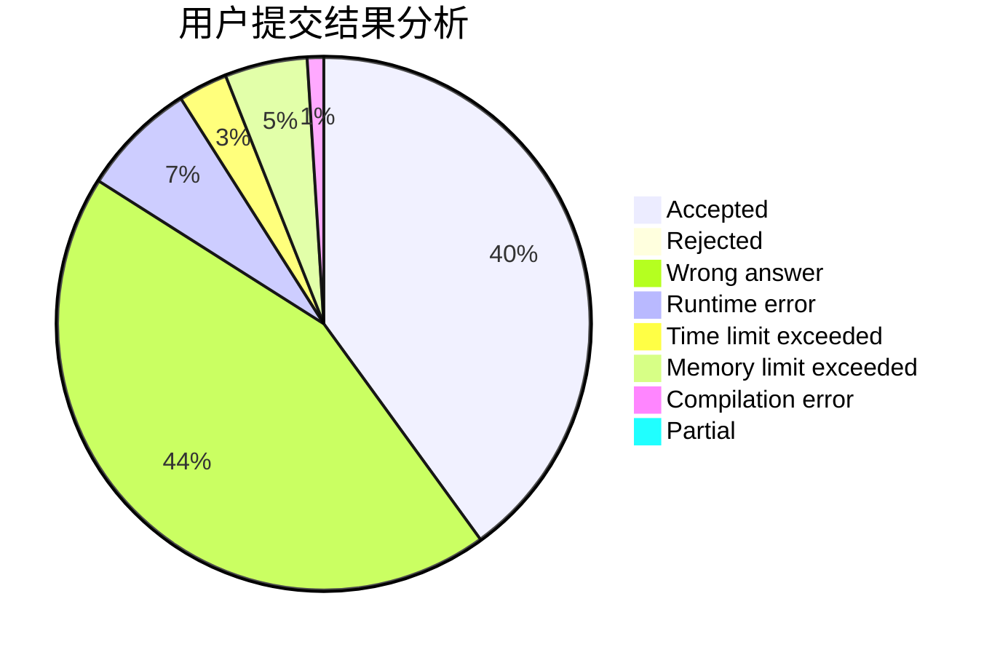
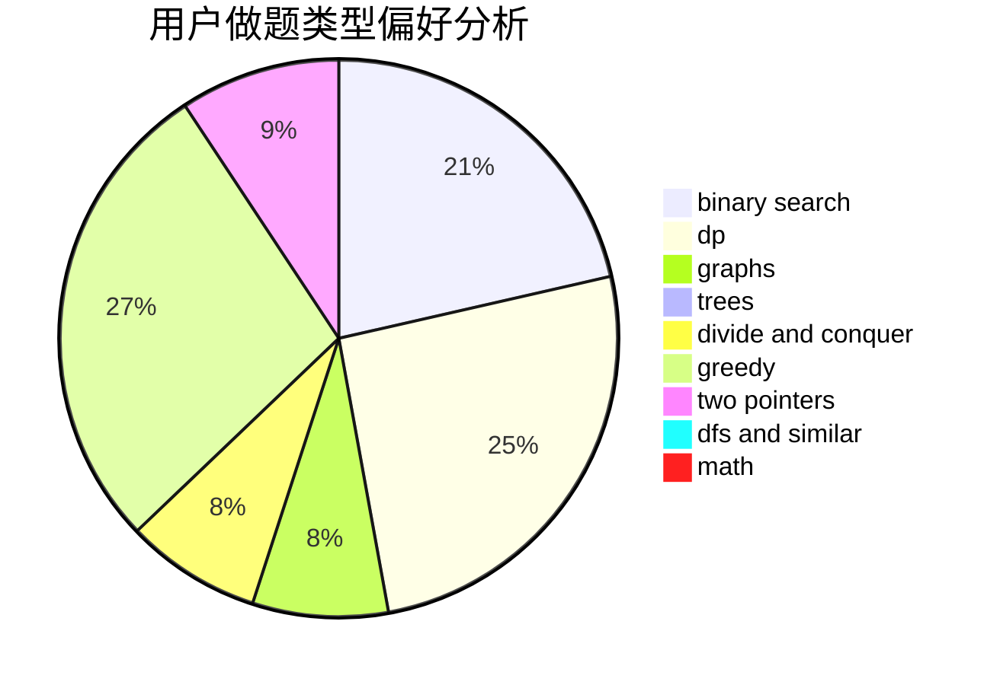

# tkj

<!-- tabs:start -->

#### **用户提交结果分析**

#### **用户做题类型偏好分析**

<!-- tabs:end -->
# 推荐题目
[1148D](https://codeforces.com/contest/1148/problem/D)
[895B](https://codeforces.com/contest/895/problem/B)
[793F](https://codeforces.com/contest/793/problem/F)
[1278A](https://codeforces.com/contest/1278/problem/A)
[420C](https://codeforces.com/contest/420/problem/C)
[536D](https://codeforces.com/contest/536/problem/D)
[1230F](https://codeforces.com/contest/1230/problem/F)
[117E](https://codeforces.com/contest/117/problem/E)
[402B](https://codeforces.com/contest/402/problem/B)
[1162D](https://codeforces.com/contest/1162/problem/D)
