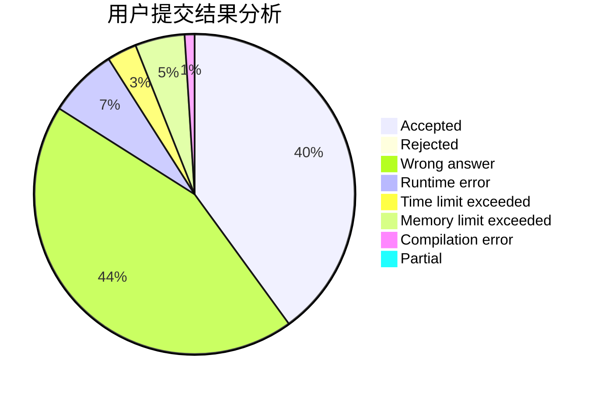
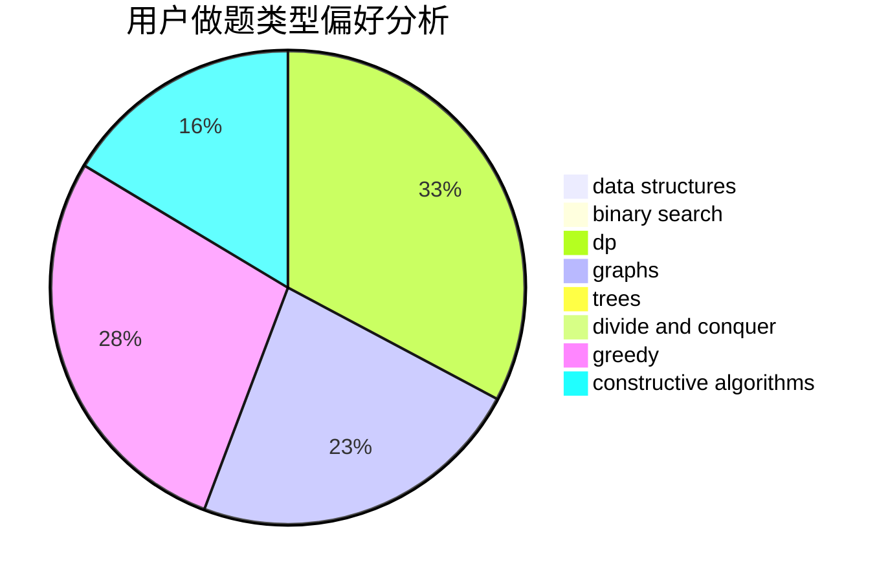

# tkj

<!-- tabs:start -->

#### **用户提交结果分析**

#### **用户做题类型偏好分析**

#### **用户错题知识点分析**

<!-- tabs:end -->
# 推荐题目
[1146D](https://codeforces.com/contest/1146/problem/D)		dfs and similar,
                        math,
                        number theory		  
[875B](https://codeforces.com/contest/875/problem/B)		dsu,
                        implementation,
                        sortings,
                        two pointers		  
[774G](https://codeforces.com/contest/774/problem/G)		*special problem,
                        number theory		  
[1269A](https://codeforces.com/contest/1269/problem/A)		brute force,
                        math		  
[391E2](https://codeforces.com/contest/391E/problem/2)		nan		  
[513A](https://codeforces.com/contest/513/problem/A)		constructive algorithms,
                        math		  
[1223G](https://codeforces.com/contest/1223/problem/G)		binary search,
                        math,
                        number theory		  
[1178A](https://codeforces.com/contest/1178/problem/A)		greedy		  
[372B](https://codeforces.com/contest/372/problem/B)		brute force,
                        divide and conquer,
                        dp		  
[1159F](https://codeforces.com/contest/1159/problem/F)		dsu,graphs,sortings,trees		  
