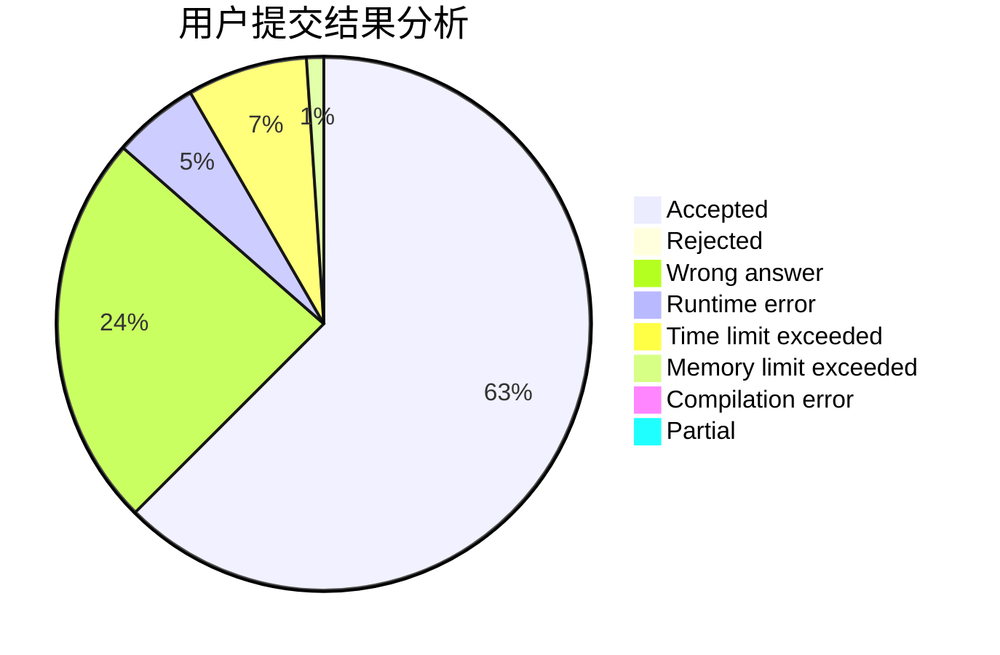
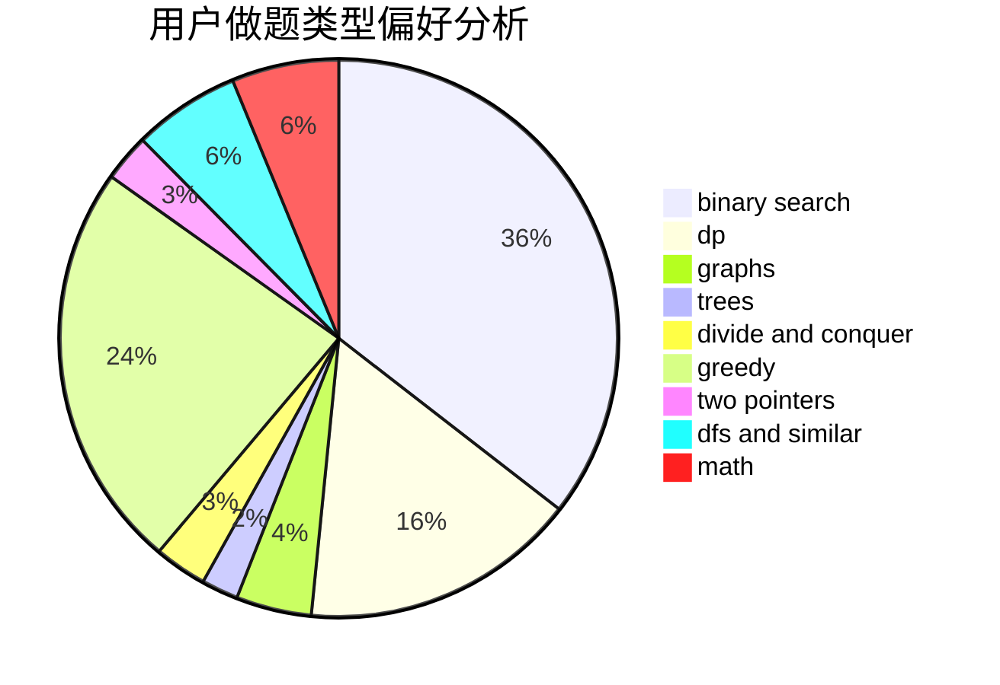

# tkysss

<!-- tabs:start -->

#### **用户提交结果分析**

#### **用户做题类型偏好分析**

<!-- tabs:end -->
# 推荐题目
[1358B](https://codeforces.com/contest/1358/problem/B)
[744D](https://codeforces.com/contest/744/problem/D)
[840B](https://codeforces.com/contest/840/problem/B)
[1332B](https://codeforces.com/contest/1332/problem/B)
[1107C](https://codeforces.com/contest/1107/problem/C)
[1290A](https://codeforces.com/contest/1290/problem/A)
[618F](https://codeforces.com/contest/618/problem/F)
[12102](https://codeforces.com/contest/1210/problem/2)
[1169B](https://codeforces.com/contest/1169/problem/B)
[946B](https://codeforces.com/contest/946/problem/B)
