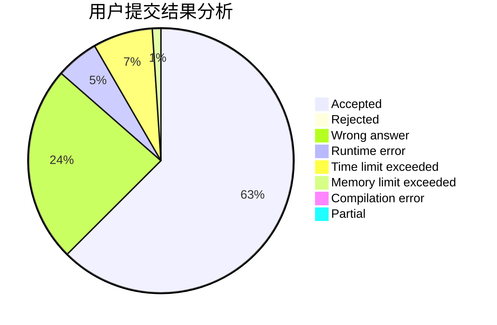
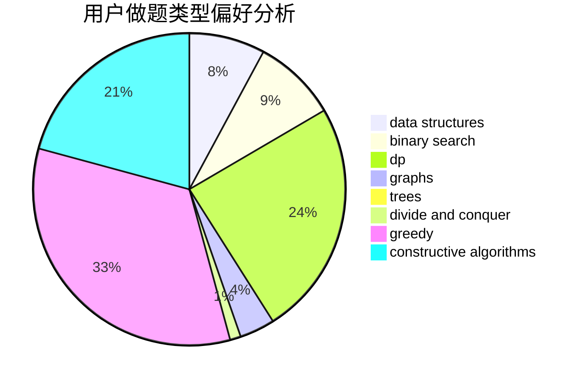
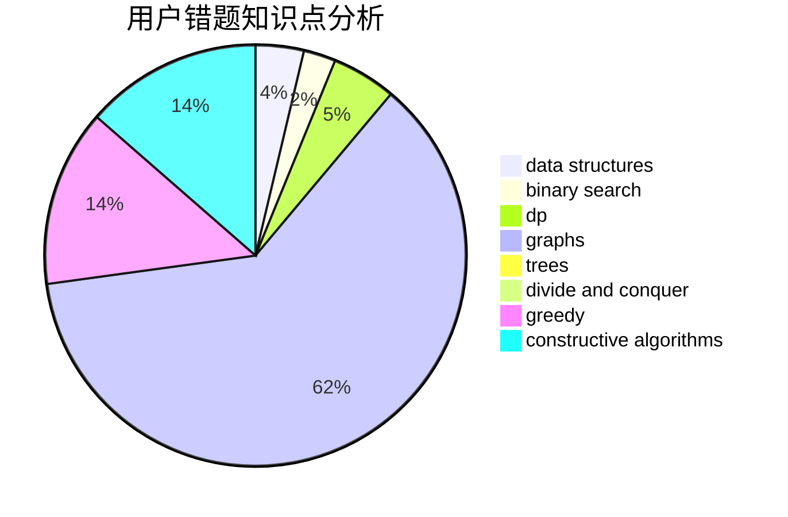

# tkysss

<!-- tabs:start -->

#### **用户提交结果分析**

#### **用户做题类型偏好分析**

#### **用户错题知识点分析**

<!-- tabs:end -->
# 推荐题目
[1358B](https://codeforces.com/contest/1358/problem/B)		greedy,
                        sortings		  
[744D](https://codeforces.com/contest/744/problem/D)		geometry		  
[840B](https://codeforces.com/contest/840/problem/B)		constructive algorithms,
                        data structures,
                        dfs and similar,
                        dp,
                        graphs		  
[1332B](https://codeforces.com/contest/1332/problem/B)		brute force,
                        constructive algorithms,
                        greedy,
                        math,
                        number theory		  
[1107C](https://codeforces.com/contest/1107/problem/C)		greedy,
                        sortings,
                        two pointers		  
[1290A](https://codeforces.com/contest/1290/problem/A)		brute force,
                        data structures,
                        implementation		  
[618F](https://codeforces.com/contest/618/problem/F)		constructive algorithms,
                        two pointers		  
[12102](https://codeforces.com/contest/1210/problem/2)		dsu,graphs,sortings,trees		  
[1169B](https://codeforces.com/contest/1169/problem/B)		graphs,
                        implementation		  
[946B](https://codeforces.com/contest/946/problem/B)		math,
                        number theory		  
