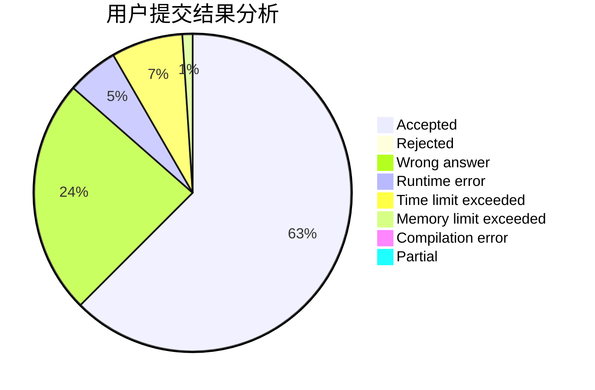
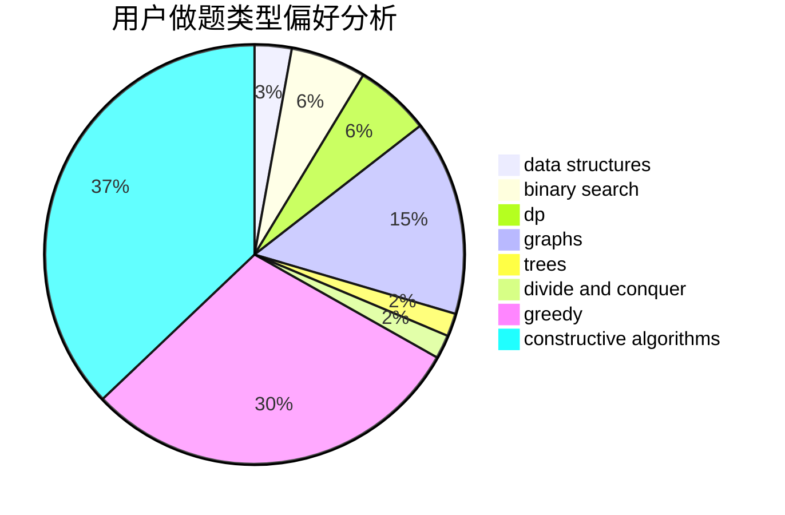
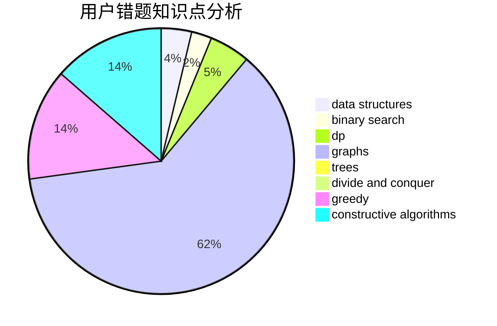

# tkysss

<!-- tabs:start -->

#### **用户提交结果分析**

#### **用户做题类型偏好分析**

#### **用户错题知识点分析**

<!-- tabs:end -->
# 推荐题目
[1351A](https://codeforces.com/contest/1351/problem/A)		implementation		  
[727C](https://codeforces.com/contest/727/problem/C)		constructive algorithms,
                        interactive,
                        math		  
[820B](https://codeforces.com/contest/820/problem/B)		constructive algorithms,
                        geometry,
                        math		  
[1325F](https://codeforces.com/contest/1325/problem/F)		constructive algorithms,
                        dfs and similar,
                        graphs,
                        greedy		  
[1106F](https://codeforces.com/contest/1106/problem/F)		math,
                        matrices,
                        number theory		  
[1283A](https://codeforces.com/contest/1283/problem/A)		math		  
[5E](https://codeforces.com/contest/5/problem/E)		data structures		  
[1206A](https://codeforces.com/contest/1206/problem/A)		math,
                        sortings		  
[1166C](https://codeforces.com/contest/1166/problem/C)		binary search,
                        sortings,
                        two pointers		  
[922B](https://codeforces.com/contest/922/problem/B)		brute force		  
