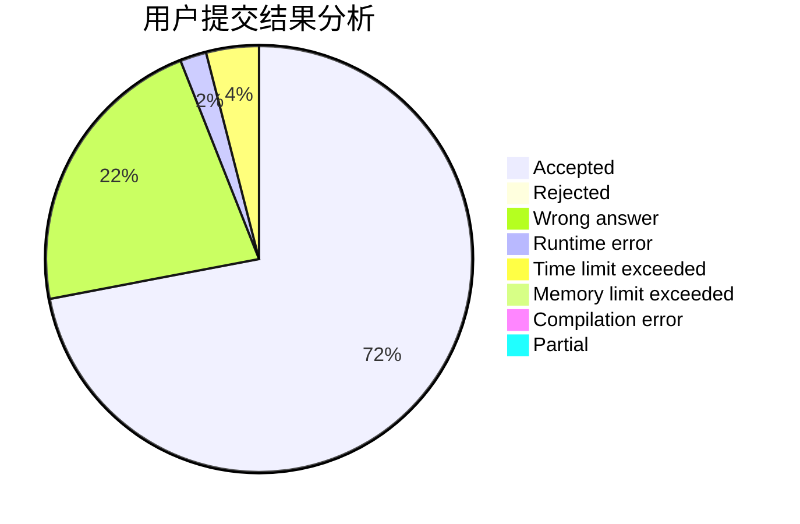
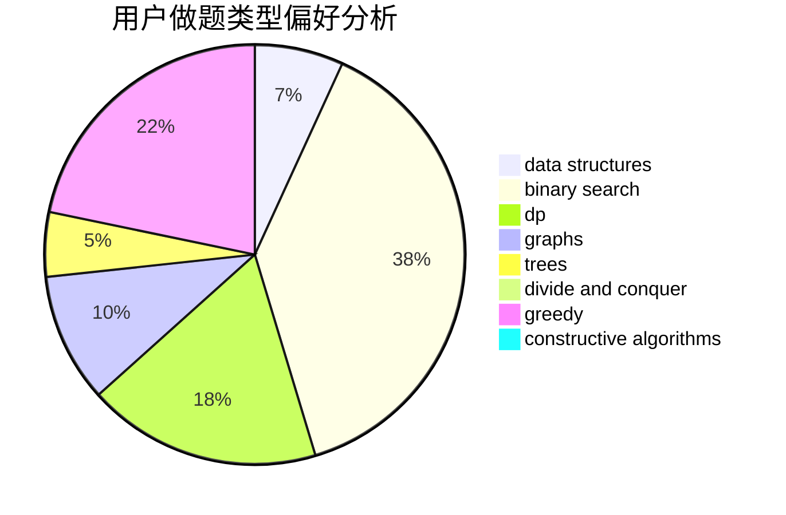

# tkz

<!-- tabs:start -->

#### **用户提交结果分析**

#### **用户做题类型偏好分析**

#### **用户错题知识点分析**

<!-- tabs:end -->
# 推荐题目
[643G](https://codeforces.com/contest/643/problem/G)		data structures		  
[367B](https://codeforces.com/contest/367/problem/B)		binary search,
                        data structures		  
[1144G](https://codeforces.com/contest/1144/problem/G)		dp,
                        greedy		  
[833B](https://codeforces.com/contest/833/problem/B)		binary search,
                        data structures,
                        divide and conquer,
                        dp,
                        two pointers		  
[712E](https://codeforces.com/contest/712/problem/E)		data structures,
                        math,
                        probabilities		  
[1000E](https://codeforces.com/contest/1000/problem/E)		dfs and similar,
                        graphs,
                        trees		  
[632F](https://codeforces.com/contest/632/problem/F)		brute force,
                        divide and conquer,
                        graphs,
                        matrices,
                        trees		  
[535A](https://codeforces.com/contest/535/problem/A)		brute force,
                        implementation		  
[1417B](https://codeforces.com/contest/1417/problem/B)		greedy,
                        math,
                        sortings		  
[1296D](https://codeforces.com/contest/1296/problem/D)		greedy,
                        sortings		  
