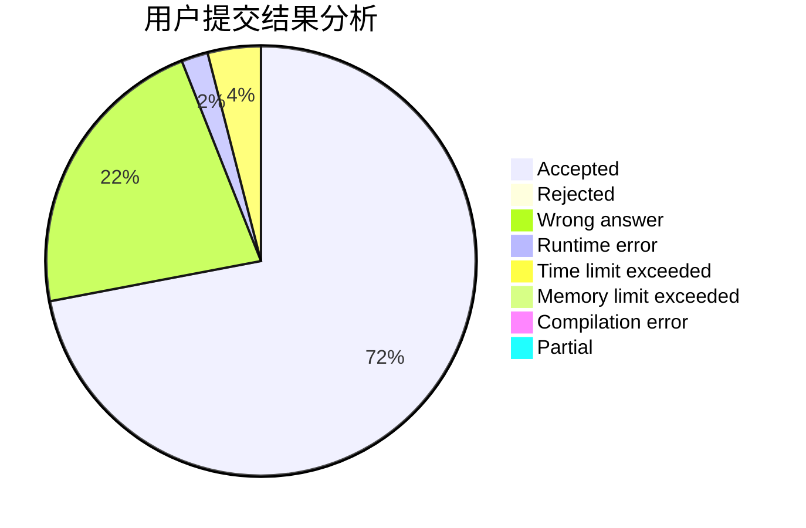
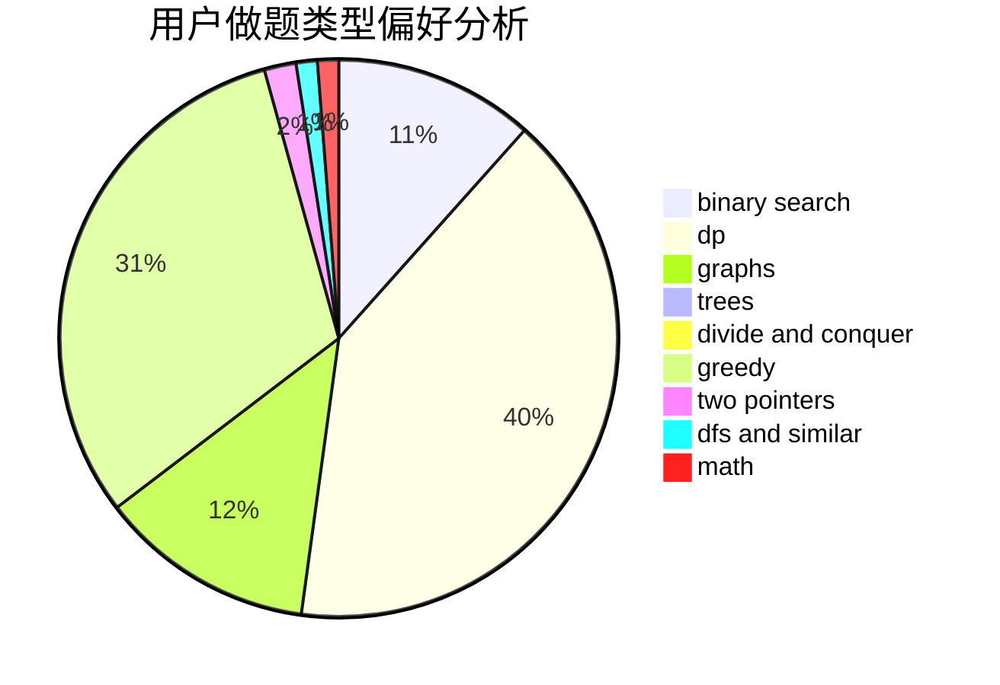

# tkz

<!-- tabs:start -->

#### **用户提交结果分析**

#### **用户做题类型偏好分析**

<!-- tabs:end -->
# 推荐题目
[671A](https://codeforces.com/contest/671/problem/A)
[398A](https://codeforces.com/contest/398/problem/A)
[1147A](https://codeforces.com/contest/1147/problem/A)
[851B](https://codeforces.com/contest/851/problem/B)
[732A](https://codeforces.com/contest/732/problem/A)
[1000E](https://codeforces.com/contest/1000/problem/E)
[665B](https://codeforces.com/contest/665/problem/B)
[557C](https://codeforces.com/contest/557/problem/C)
[1424J](https://codeforces.com/contest/1424/problem/J)
[1303F](https://codeforces.com/contest/1303/problem/F)
