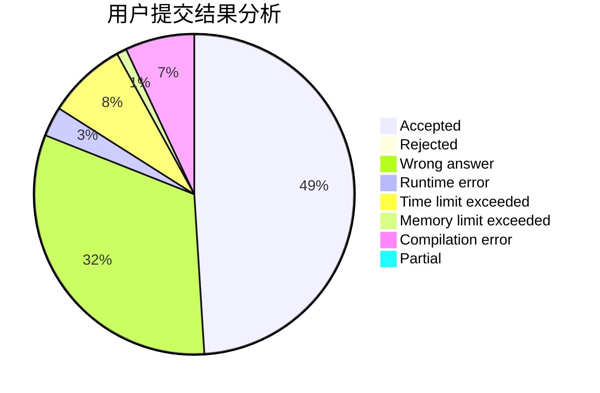
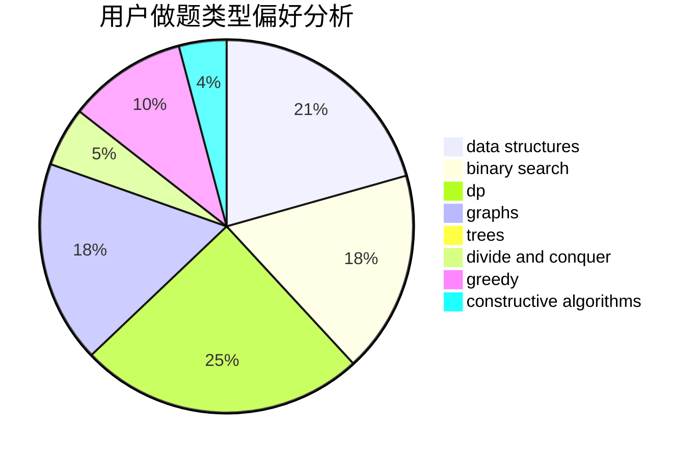
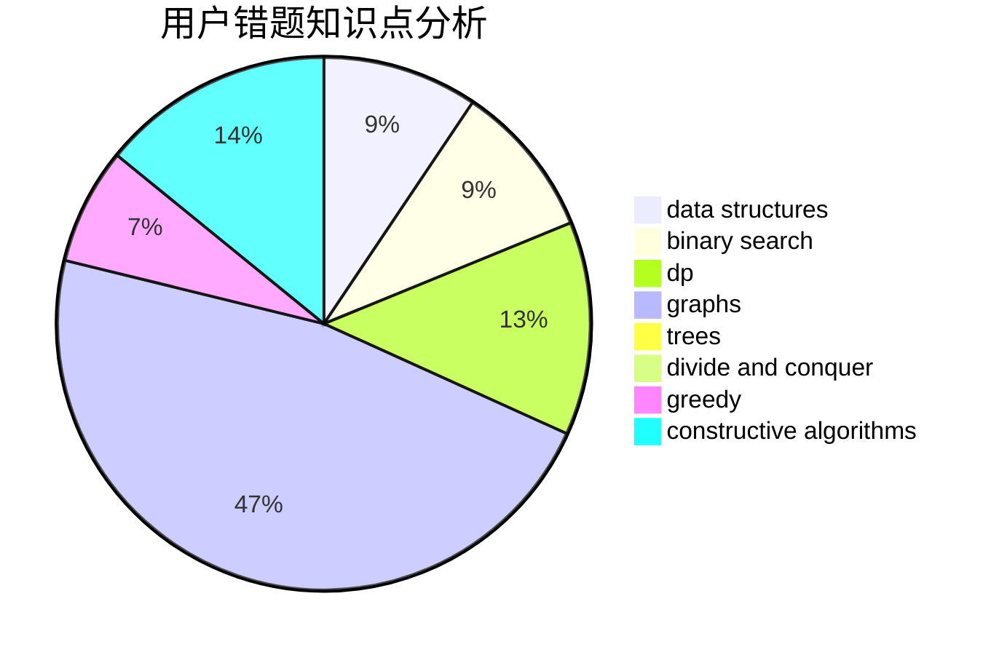

# tlnllkbp

<!-- tabs:start -->

#### **用户提交结果分析**

#### **用户做题类型偏好分析**

#### **用户错题知识点分析**

<!-- tabs:end -->
# 推荐题目
[1264A](https://codeforces.com/contest/1264/problem/A)		greedy,
                        implementation		  
[1009E](https://codeforces.com/contest/1009/problem/E)		combinatorics,
                        math,
                        probabilities		  
[1030C](https://codeforces.com/contest/1030/problem/C)		implementation		  
[801D](https://codeforces.com/contest/801/problem/D)		dsu,graphs,sortings,trees		  
[1028H](https://codeforces.com/contest/1028/problem/H)		math		  
[643E](https://codeforces.com/contest/643/problem/E)		dp,
                        math,
                        probabilities,
                        trees		  
[46A](https://codeforces.com/contest/46/problem/A)		brute force,
                        implementation		  
[911B](https://codeforces.com/contest/911/problem/B)		binary search,
                        brute force,
                        implementation		  
[181B](https://codeforces.com/contest/181/problem/B)		binary search,
                        brute force		  
[1101C](https://codeforces.com/contest/1101/problem/C)		sortings		  
