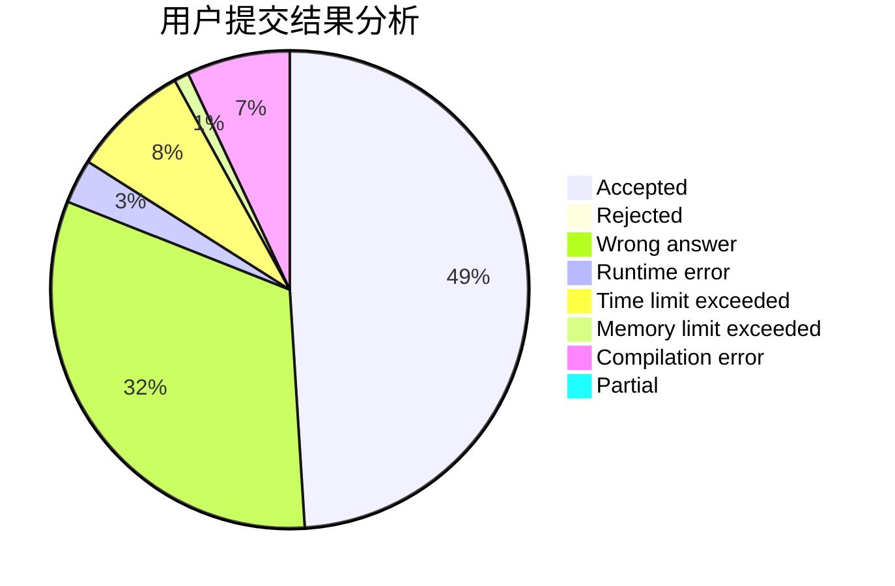
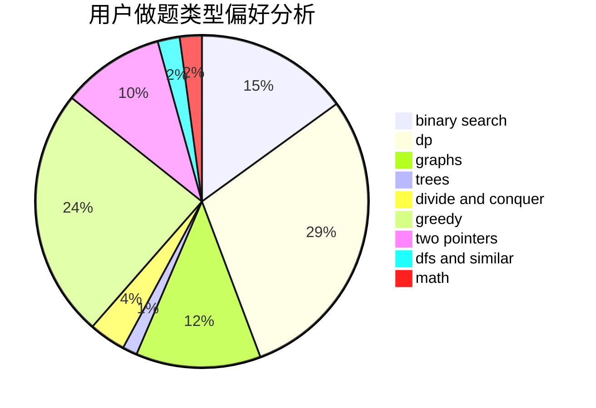

# tlnllkbp

<!-- tabs:start -->

#### **用户提交结果分析**

#### **用户做题类型偏好分析**

<!-- tabs:end -->
# 推荐题目
[1264A](https://codeforces.com/contest/1264/problem/A)
[1009E](https://codeforces.com/contest/1009/problem/E)
[1030C](https://codeforces.com/contest/1030/problem/C)
[801D](https://codeforces.com/contest/801/problem/D)
[1028H](https://codeforces.com/contest/1028/problem/H)
[643E](https://codeforces.com/contest/643/problem/E)
[46A](https://codeforces.com/contest/46/problem/A)
[911B](https://codeforces.com/contest/911/problem/B)
[181B](https://codeforces.com/contest/181/problem/B)
[1101C](https://codeforces.com/contest/1101/problem/C)
