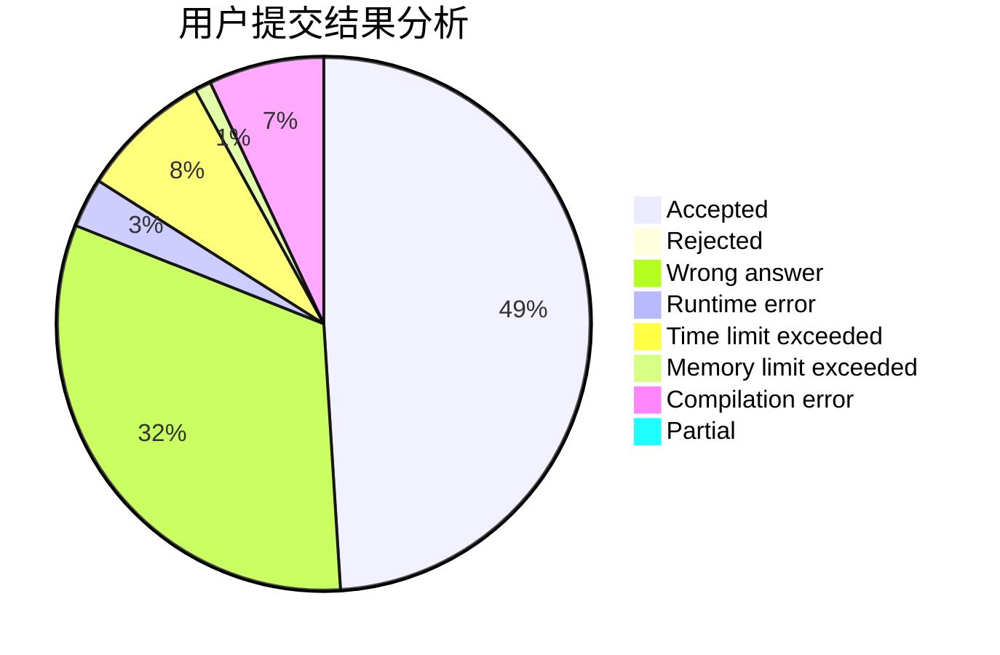
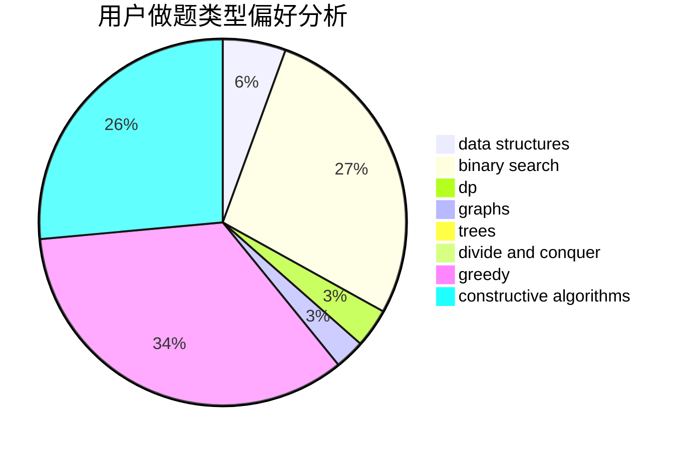
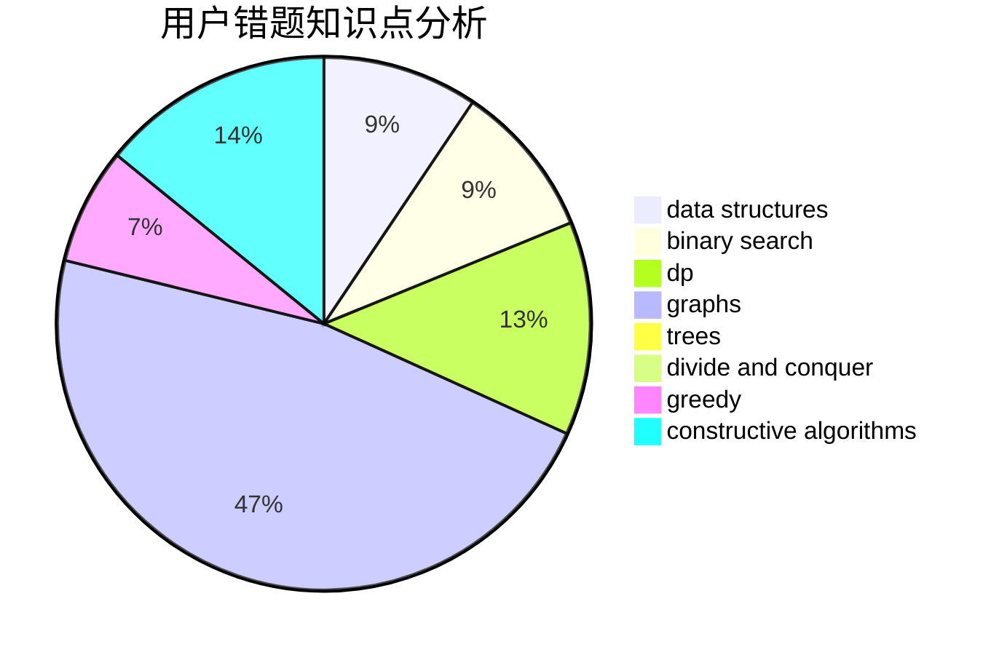

# tlnllkbp

<!-- tabs:start -->

#### **用户提交结果分析**

#### **用户做题类型偏好分析**

#### **用户错题知识点分析**

<!-- tabs:end -->
# 推荐题目
[1257A](https://codeforces.com/contest/1257/problem/A)		greedy,
                        math		  
[1009B](https://codeforces.com/contest/1009/problem/B)		greedy,
                        implementation		  
[102B](https://codeforces.com/contest/102/problem/B)		implementation		  
[784D](https://codeforces.com/contest/784/problem/D)		*special problem,
                        implementation		  
[1028D](https://codeforces.com/contest/1028/problem/D)		combinatorics,
                        data structures,
                        greedy		  
[620B](https://codeforces.com/contest/620/problem/B)		implementation		  
[449D](https://codeforces.com/contest/449/problem/D)		bitmasks,
                        combinatorics,
                        dp		  
[893B](https://codeforces.com/contest/893/problem/B)		brute force,
                        implementation		  
[15A](https://codeforces.com/contest/15/problem/A)		implementation,
                        sortings		  
[1100F](https://codeforces.com/contest/1100/problem/F)		data structures,
                        divide and conquer,
                        greedy,
                        math		  
