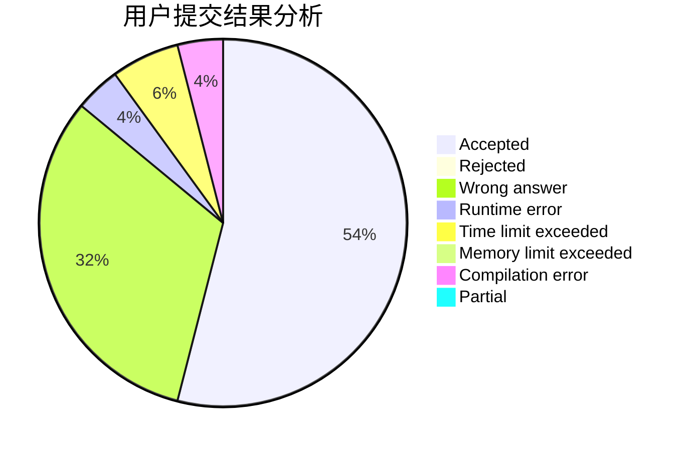
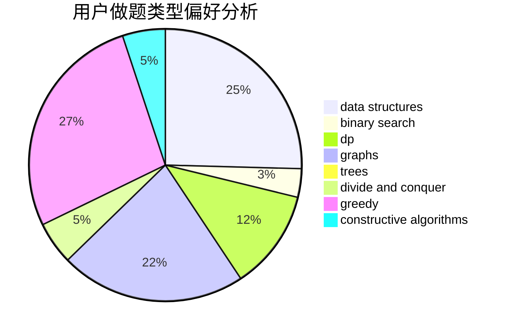
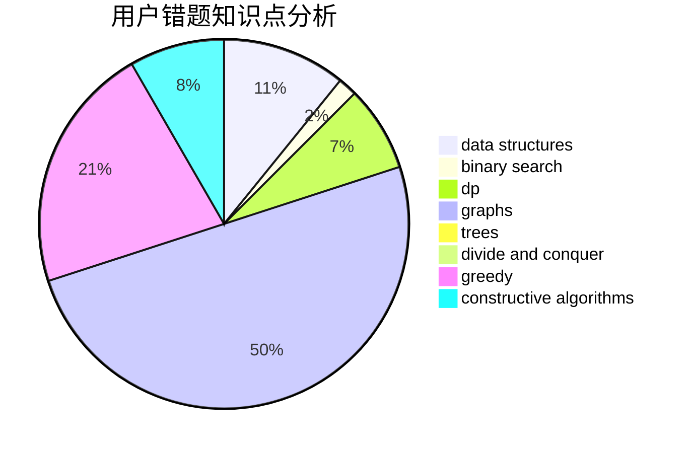

# tly007

<!-- tabs:start -->

#### **用户提交结果分析**

#### **用户做题类型偏好分析**

#### **用户错题知识点分析**

<!-- tabs:end -->
# 推荐题目
[746A](https://codeforces.com/contest/746/problem/A)		implementation,
                        math		  
[845D](https://codeforces.com/contest/845/problem/D)		data structures,
                        dp,
                        greedy		  
[628C](https://codeforces.com/contest/628/problem/C)		greedy,
                        strings		  
[414D](https://codeforces.com/contest/414/problem/D)		binary search,
                        data structures,
                        greedy,
                        trees,
                        two pointers		  
[749D](https://codeforces.com/contest/749/problem/D)		binary search,
                        data structures		  
[1467E](https://codeforces.com/contest/1467/problem/E)		data structures,
                        dfs and similar,
                        dp,
                        trees		  
[1313C2](https://codeforces.com/contest/1313C/problem/2)		data structures,
                        dp,
                        greedy		  
[1419A](https://codeforces.com/contest/1419/problem/A)		games,
                        greedy,
                        implementation		  
[1489A](https://codeforces.com/contest/1489/problem/A)		dsu,graphs,sortings,trees		  
[1482E](https://codeforces.com/contest/1482/problem/E)		data structures,
                        divide and conquer,
                        dp		  
