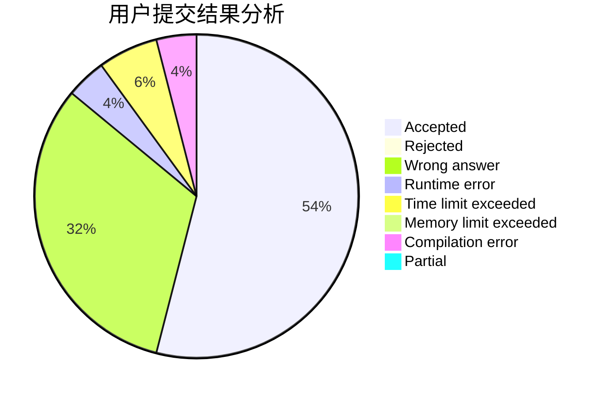
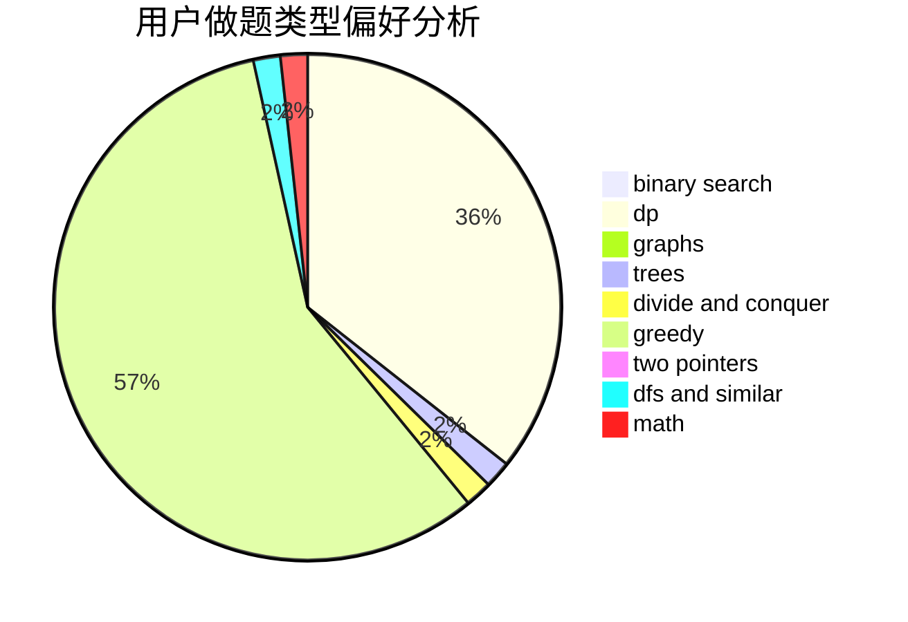

# tly007

<!-- tabs:start -->

#### **用户提交结果分析**

#### **用户做题类型偏好分析**

<!-- tabs:end -->
# 推荐题目
[765C](https://codeforces.com/contest/765/problem/C)
[863E](https://codeforces.com/contest/863/problem/E)
[656D](https://codeforces.com/contest/656/problem/D)
[43A](https://codeforces.com/contest/43/problem/A)
[768D](https://codeforces.com/contest/768/problem/D)
[1475A](https://codeforces.com/contest/1475/problem/A)
[1323A](https://codeforces.com/contest/1323/problem/A)
[1426E](https://codeforces.com/contest/1426/problem/E)
[14971](https://codeforces.com/contest/1497/problem/1)
[1490C](https://codeforces.com/contest/1490/problem/C)
