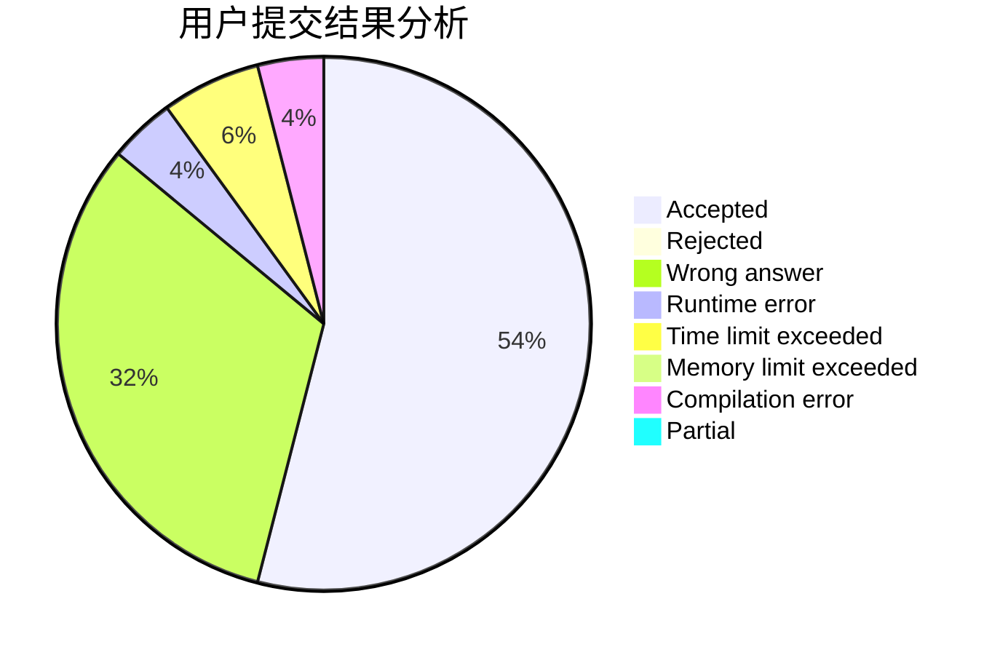
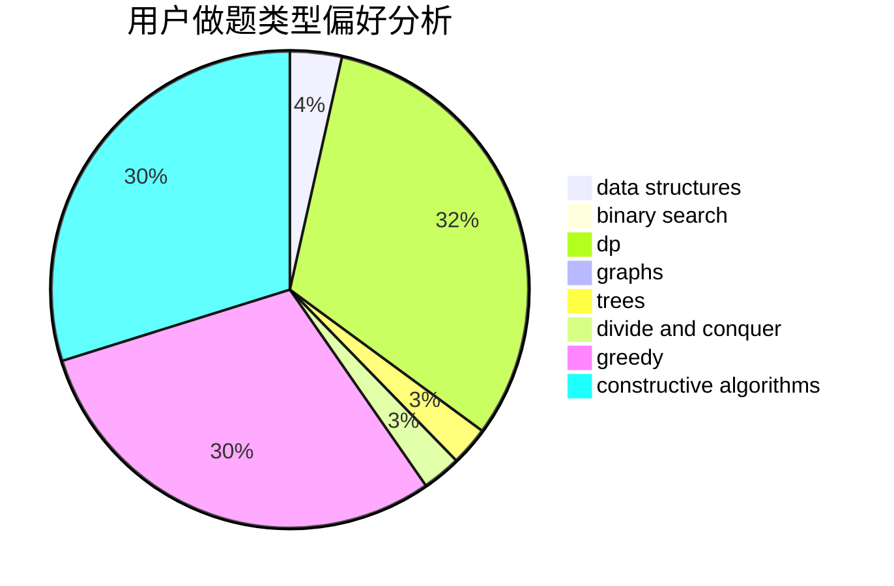
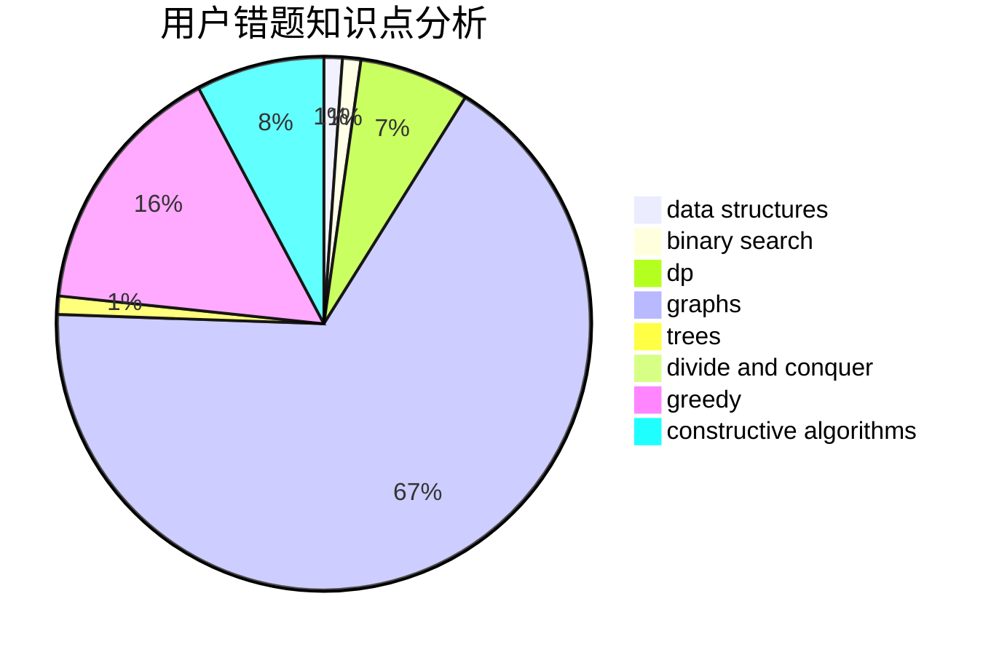

# tly007

<!-- tabs:start -->

#### **用户提交结果分析**

#### **用户做题类型偏好分析**

#### **用户错题知识点分析**

<!-- tabs:end -->
# 推荐题目
[765C](https://codeforces.com/contest/765/problem/C)		math		  
[863E](https://codeforces.com/contest/863/problem/E)		data structures,
                        sortings		  
[656D](https://codeforces.com/contest/656/problem/D)		*special problem		  
[43A](https://codeforces.com/contest/43/problem/A)		strings		  
[768D](https://codeforces.com/contest/768/problem/D)		dp,
                        math,
                        probabilities		  
[1475A](https://codeforces.com/contest/1475/problem/A)		math,
                        number theory		  
[1323A](https://codeforces.com/contest/1323/problem/A)		brute force,
                        dp,
                        greedy,
                        implementation		  
[1426E](https://codeforces.com/contest/1426/problem/E)		brute force,
                        constructive algorithms,
                        flows,
                        greedy,
                        math		  
[14971](https://codeforces.com/contest/1497/problem/1)		dsu,graphs,sortings,trees		  
[1490C](https://codeforces.com/contest/1490/problem/C)		binary search,
                        brute force,
                        brute force,
                        math		  
