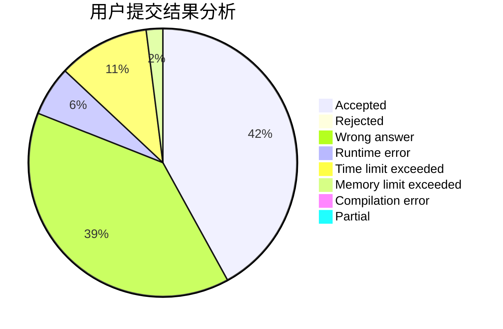
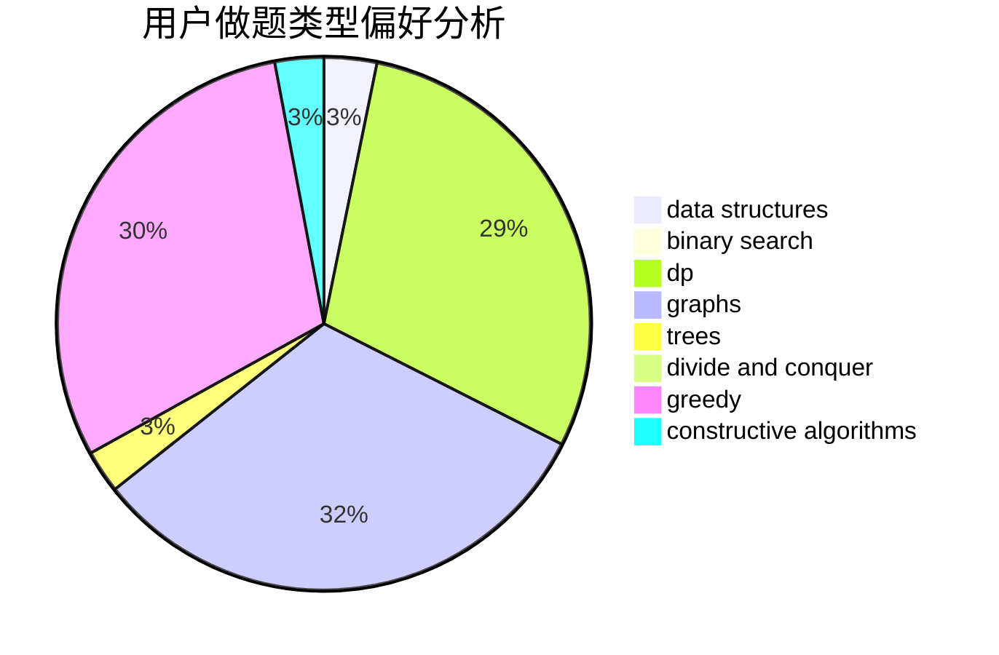
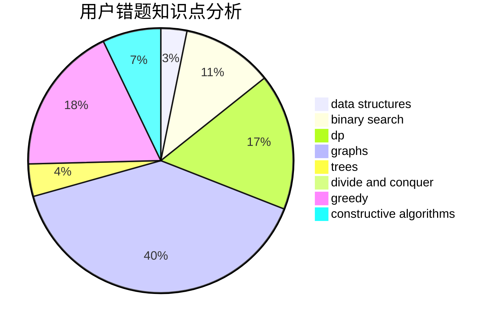

# tlylz99

<!-- tabs:start -->

#### **用户提交结果分析**

#### **用户做题类型偏好分析**

#### **用户错题知识点分析**

<!-- tabs:end -->
# 推荐题目
[1501C](https://codeforces.com/contest/1501/problem/C)		dsu,graphs,sortings,trees		  
[165A](https://codeforces.com/contest/165/problem/A)		implementation		  
[960B](https://codeforces.com/contest/960/problem/B)		data structures,
                        greedy,
                        sortings		  
[890C](https://codeforces.com/contest/890/problem/C)		dsu,graphs,sortings,trees		  
[610E](https://codeforces.com/contest/610/problem/E)		data structures,
                        strings		  
[429E](https://codeforces.com/contest/429/problem/E)		graphs		  
[1511E](https://codeforces.com/contest/1511/problem/E)		combinatorics,
                        dp,
                        greedy,
                        math		  
[1280C](https://codeforces.com/contest/1280/problem/C)		dfs and similar,
                        graphs,
                        greedy,
                        trees		  
[1074B](https://codeforces.com/contest/1074/problem/B)		dsu,graphs,sortings,trees		  
[1073F](https://codeforces.com/contest/1073/problem/F)		dfs and similar,
                        dp,
                        greedy,
                        trees		  
