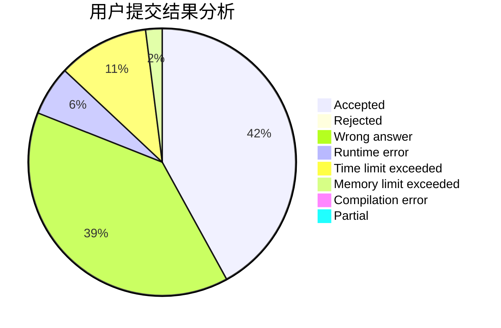
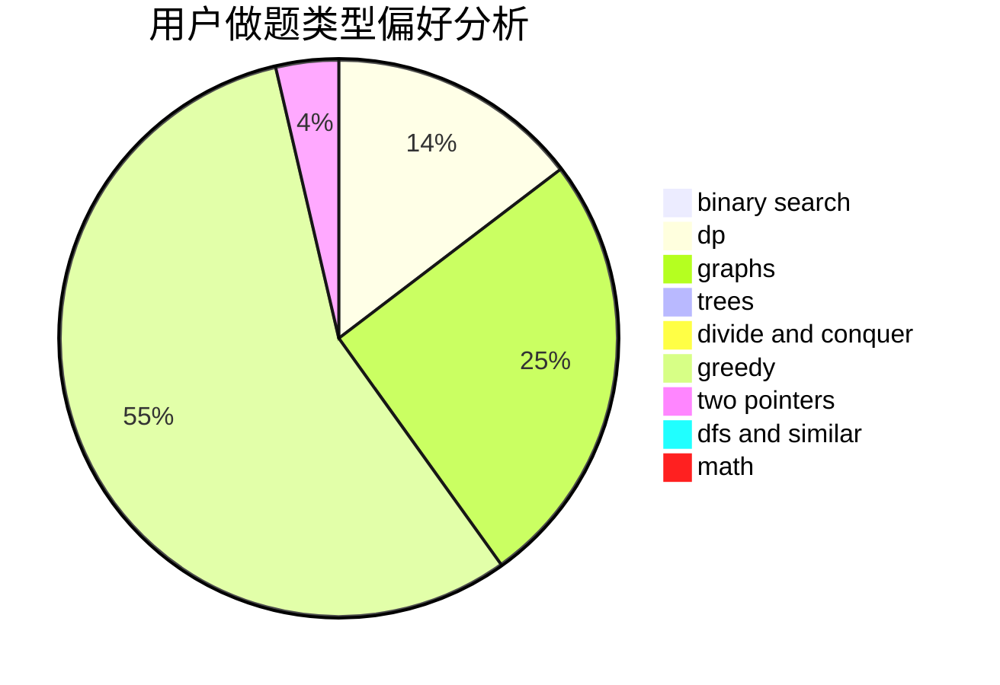

# tlylz99

<!-- tabs:start -->

#### **用户提交结果分析**

#### **用户做题类型偏好分析**

<!-- tabs:end -->
# 推荐题目
[1511D](https://codeforces.com/contest/1511/problem/D)
[18C](https://codeforces.com/contest/18/problem/C)
[982A](https://codeforces.com/contest/982/problem/A)
[909D](https://codeforces.com/contest/909/problem/D)
[62E](https://codeforces.com/contest/62/problem/E)
[451A](https://codeforces.com/contest/451/problem/A)
[16B](https://codeforces.com/contest/16/problem/B)
[1286D](https://codeforces.com/contest/1286/problem/D)
[1076A](https://codeforces.com/contest/1076/problem/A)
[1074B](https://codeforces.com/contest/1074/problem/B)
