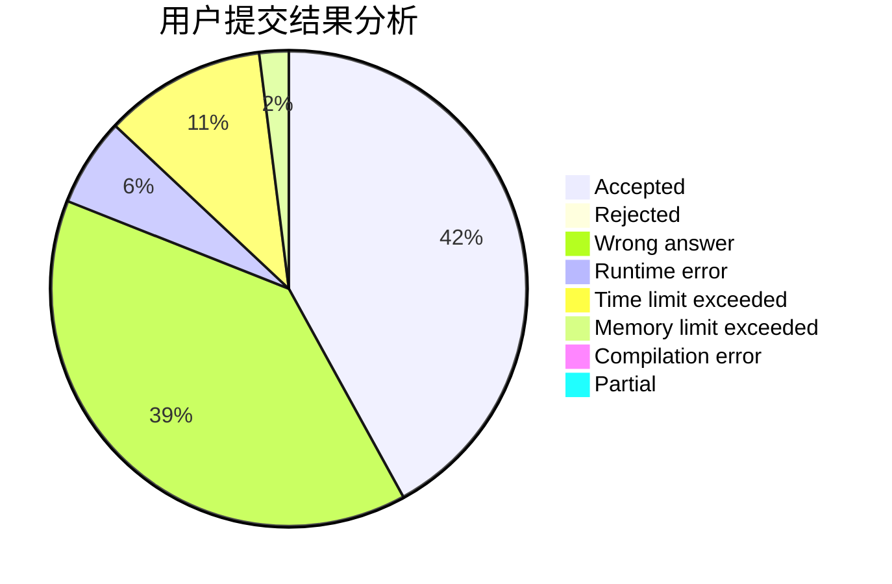
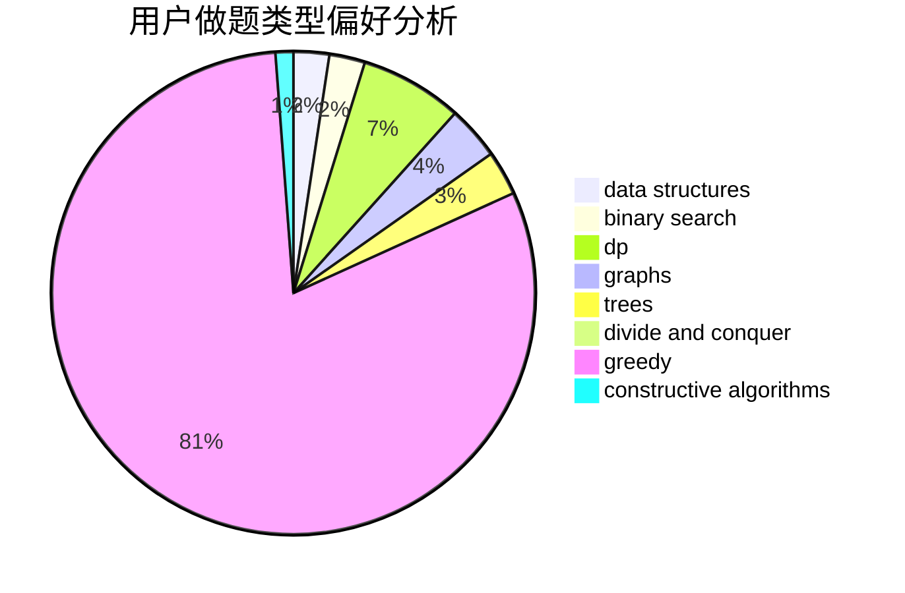
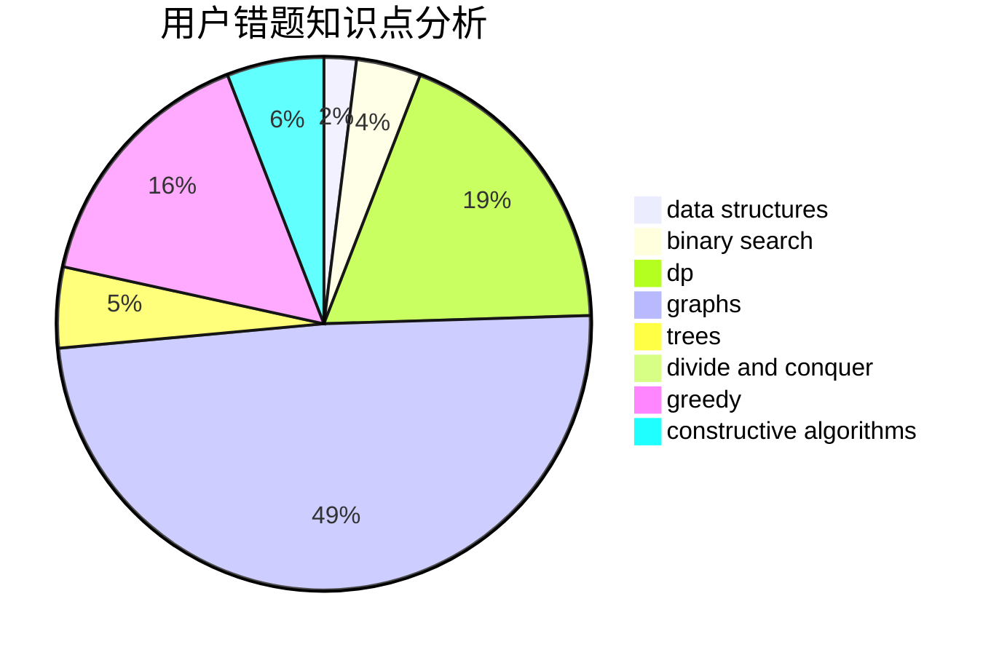

# tlylz99

<!-- tabs:start -->

#### **用户提交结果分析**

#### **用户做题类型偏好分析**

#### **用户错题知识点分析**

<!-- tabs:end -->
# 推荐题目
[1511D](https://codeforces.com/contest/1511/problem/D)		brute force,
                        constructive algorithms,
                        graphs,
                        greedy,
                        strings		  
[18C](https://codeforces.com/contest/18/problem/C)		data structures,
                        implementation		  
[982A](https://codeforces.com/contest/982/problem/A)		brute force,
                        constructive algorithms		  
[909D](https://codeforces.com/contest/909/problem/D)		data structures,
                        greedy,
                        implementation		  
[62E](https://codeforces.com/contest/62/problem/E)		dp,
                        flows		  
[451A](https://codeforces.com/contest/451/problem/A)		implementation		  
[16B](https://codeforces.com/contest/16/problem/B)		greedy,
                        implementation,
                        sortings		  
[1286D](https://codeforces.com/contest/1286/problem/D)		data structures,
                        math,
                        matrices,
                        probabilities		  
[1076A](https://codeforces.com/contest/1076/problem/A)		greedy,
                        strings		  
[1074B](https://codeforces.com/contest/1074/problem/B)		dsu,graphs,sortings,trees		  
