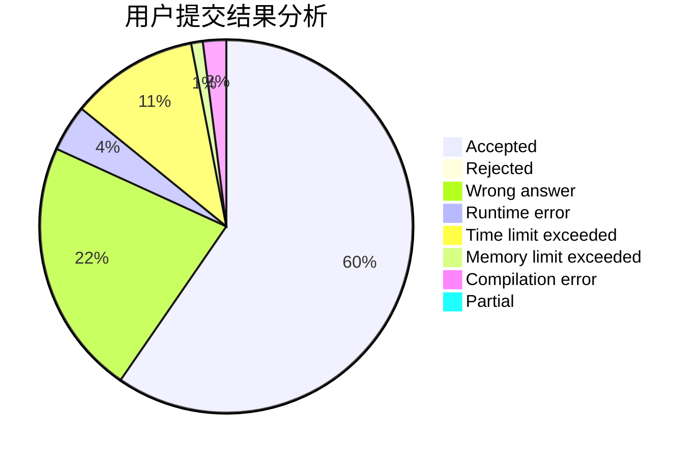
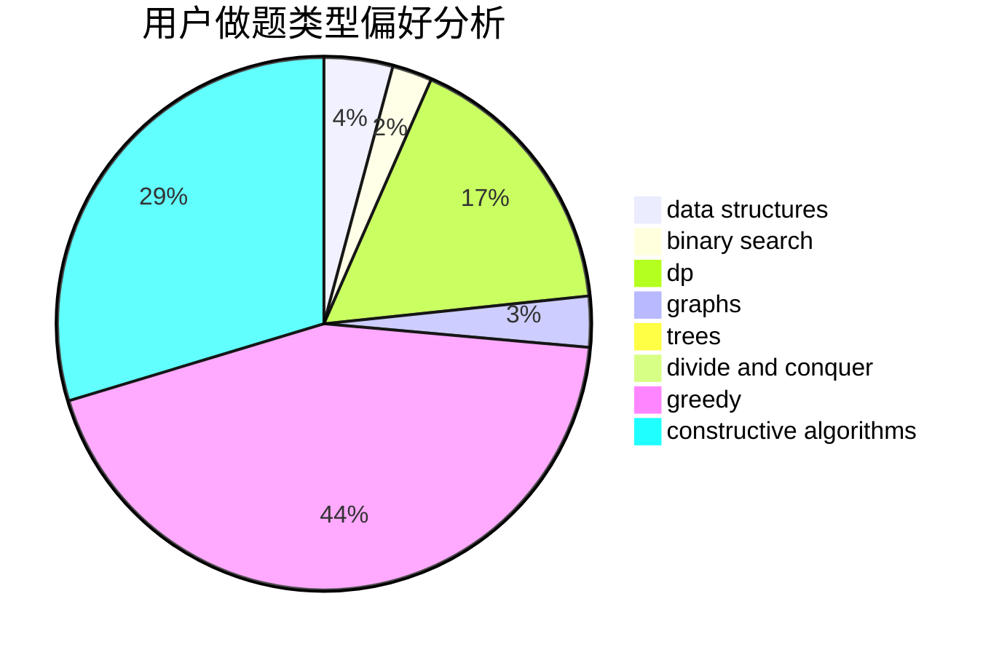

# tntdc

<!-- tabs:start -->

#### **用户提交结果分析**

#### **用户做题类型偏好分析**

#### **用户错题知识点分析**

<!-- tabs:end -->
# 推荐题目
[1389G](https://codeforces.com/contest/1389/problem/G)		dfs and similar,
                        dp,
                        graphs,
                        trees		  
[749B](https://codeforces.com/contest/749/problem/B)		brute force,
                        constructive algorithms,
                        geometry		  
[1131D](https://codeforces.com/contest/1131/problem/D)		dfs and similar,
                        dp,
                        dsu,
                        graphs,
                        greedy		  
[767A](https://codeforces.com/contest/767/problem/A)		data structures,
                        implementation		  
[935C](https://codeforces.com/contest/935/problem/C)		geometry		  
[715A](https://codeforces.com/contest/715/problem/A)		constructive algorithms,
                        math		  
[518B](https://codeforces.com/contest/518/problem/B)		greedy,
                        implementation,
                        strings		  
[725A](https://codeforces.com/contest/725/problem/A)		implementation		  
[474B](https://codeforces.com/contest/474/problem/B)		binary search,
                        implementation		  
[576C](https://codeforces.com/contest/576/problem/C)		constructive algorithms,
                        divide and conquer,
                        geometry,
                        greedy,
                        sortings		  
