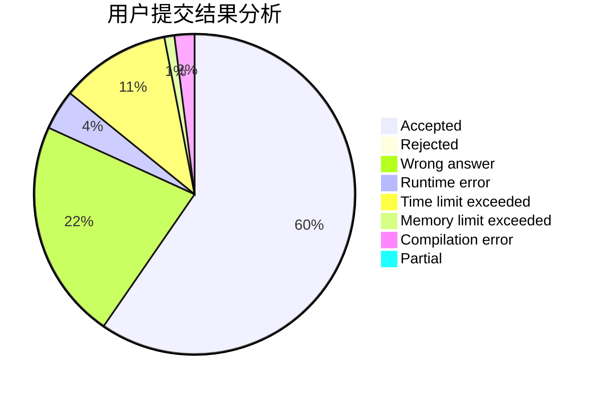
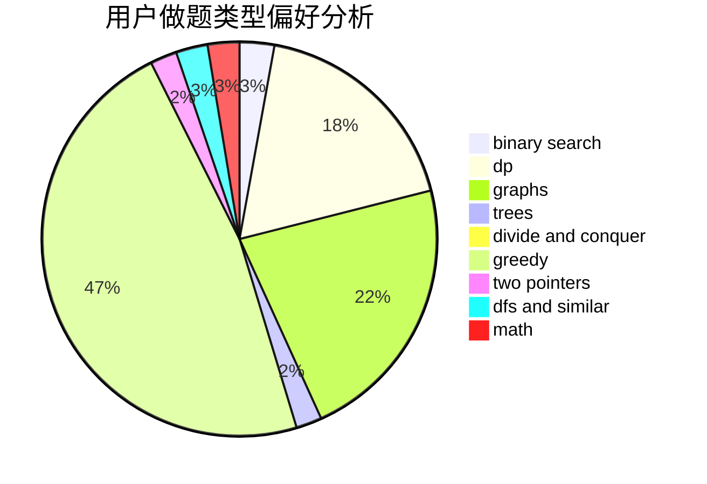

# tntdc

<!-- tabs:start -->

#### **用户提交结果分析**

#### **用户做题类型偏好分析**

<!-- tabs:end -->
# 推荐题目
[1389G](https://codeforces.com/contest/1389/problem/G)
[749B](https://codeforces.com/contest/749/problem/B)
[1131D](https://codeforces.com/contest/1131/problem/D)
[767A](https://codeforces.com/contest/767/problem/A)
[935C](https://codeforces.com/contest/935/problem/C)
[715A](https://codeforces.com/contest/715/problem/A)
[518B](https://codeforces.com/contest/518/problem/B)
[725A](https://codeforces.com/contest/725/problem/A)
[474B](https://codeforces.com/contest/474/problem/B)
[576C](https://codeforces.com/contest/576/problem/C)
