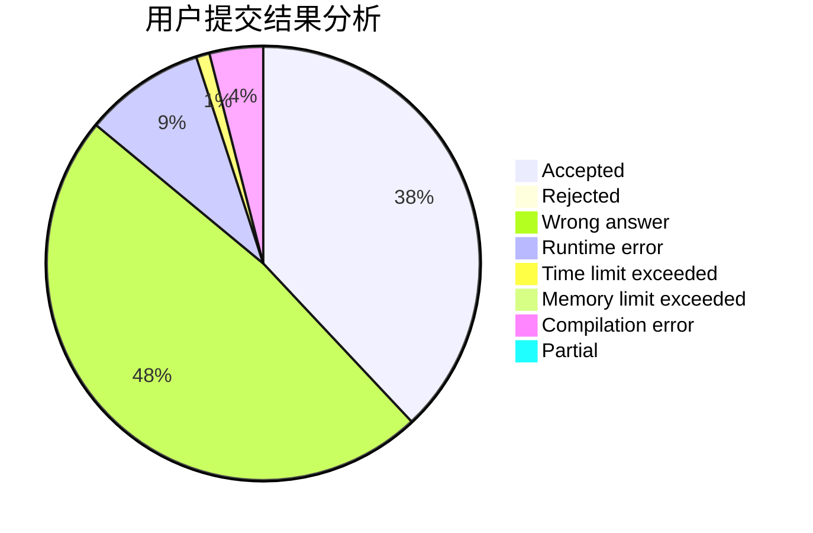
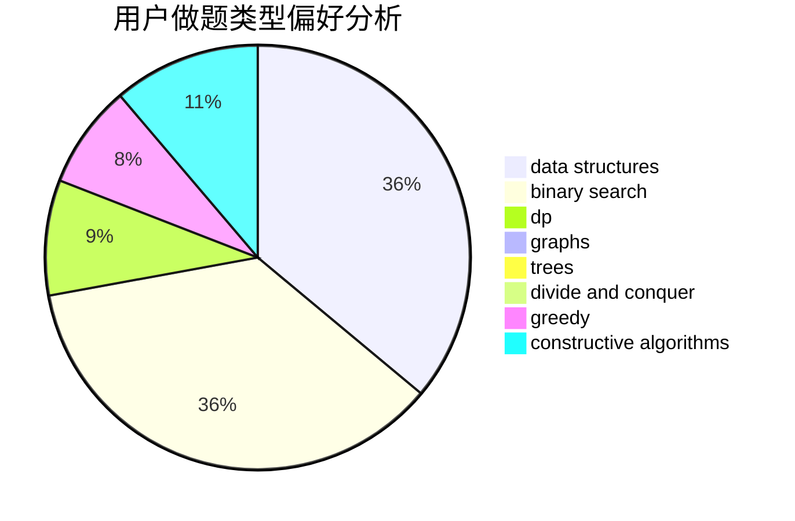
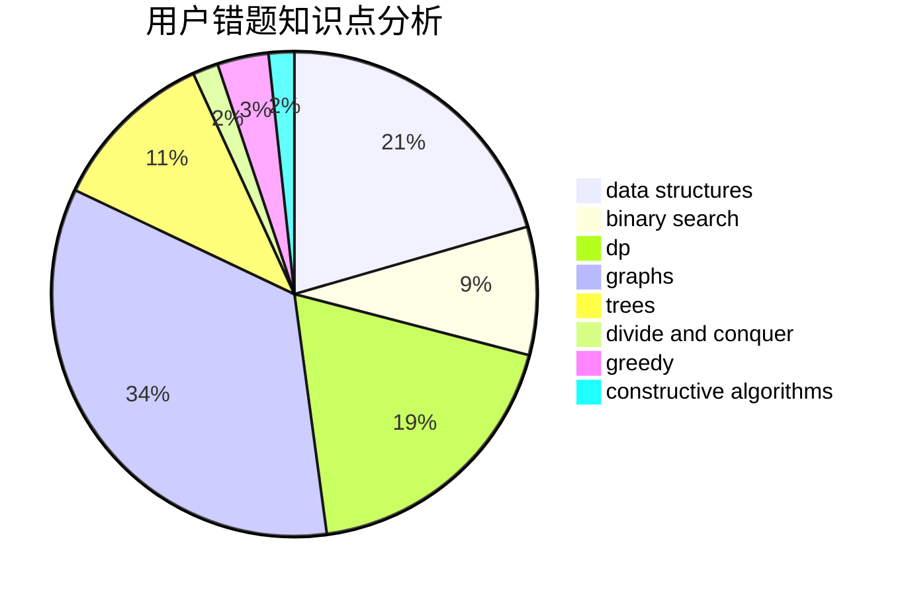

# toAC

<!-- tabs:start -->

#### **用户提交结果分析**

#### **用户做题类型偏好分析**

#### **用户错题知识点分析**

<!-- tabs:end -->
# 推荐题目
[875B](https://codeforces.com/contest/875/problem/B)		dsu,
                        implementation,
                        sortings,
                        two pointers		  
[1205E](https://codeforces.com/contest/1205/problem/E)		combinatorics,
                        strings		  
[155A](https://codeforces.com/contest/155/problem/A)		brute force		  
[268A](https://codeforces.com/contest/268/problem/A)		brute force		  
[720C](https://codeforces.com/contest/720/problem/C)		constructive algorithms		  
[641E](https://codeforces.com/contest/641/problem/E)		data structures		  
[1511A](https://codeforces.com/contest/1511/problem/A)		greedy		  
[765E](https://codeforces.com/contest/765/problem/E)		dfs and similar,
                        dp,
                        greedy,
                        implementation,
                        trees		  
[1075A](https://codeforces.com/contest/1075/problem/A)		implementation,
                        math		  
[1297D](https://codeforces.com/contest/1297/problem/D)		*special problem,
                        binary search,
                        greedy,
                        sortings		  
