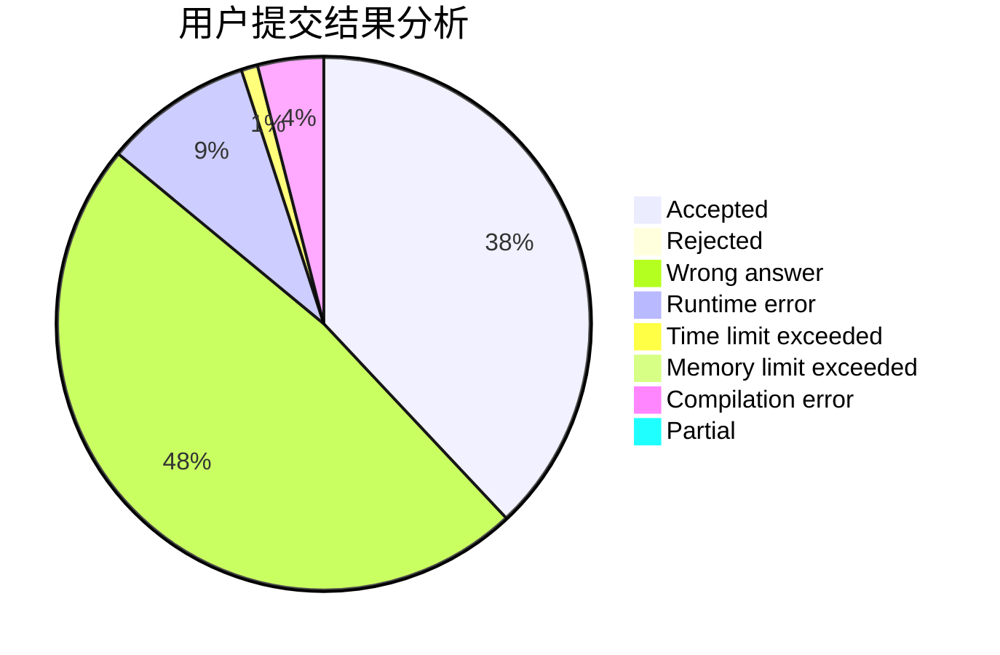
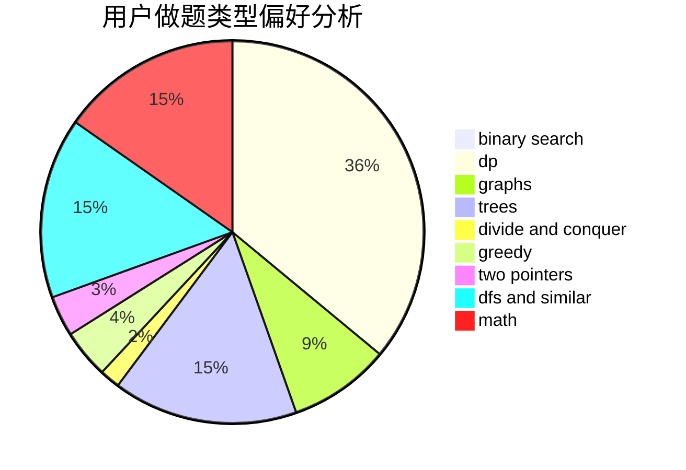

# toAC

<!-- tabs:start -->

#### **用户提交结果分析**

#### **用户做题类型偏好分析**

<!-- tabs:end -->
# 推荐题目
[895B](https://codeforces.com/contest/895/problem/B)
[120H](https://codeforces.com/contest/120/problem/H)
[176D](https://codeforces.com/contest/176/problem/D)
[283B](https://codeforces.com/contest/283/problem/B)
[737C](https://codeforces.com/contest/737/problem/C)
[6702](https://codeforces.com/contest/670/problem/2)
[167B](https://codeforces.com/contest/167/problem/B)
[785A](https://codeforces.com/contest/785/problem/A)
[1076C](https://codeforces.com/contest/1076/problem/C)
[1304D](https://codeforces.com/contest/1304/problem/D)
