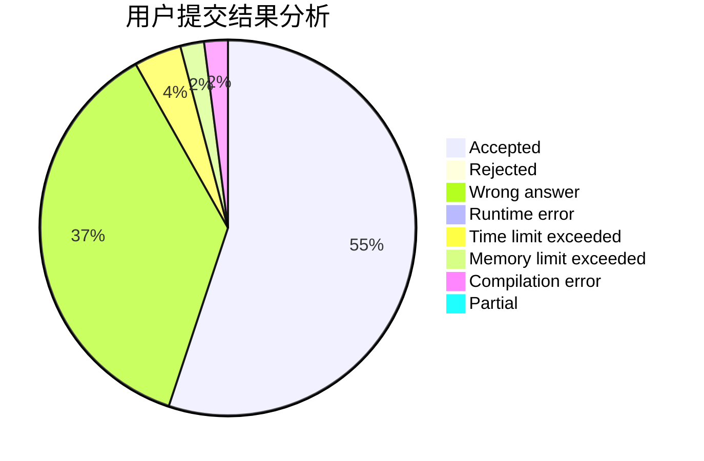
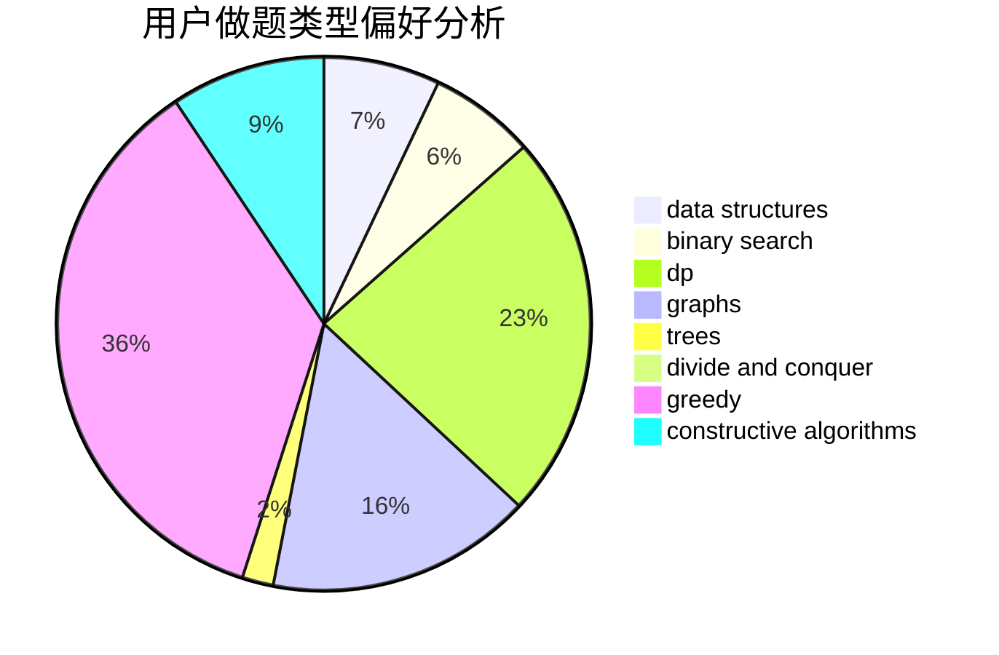
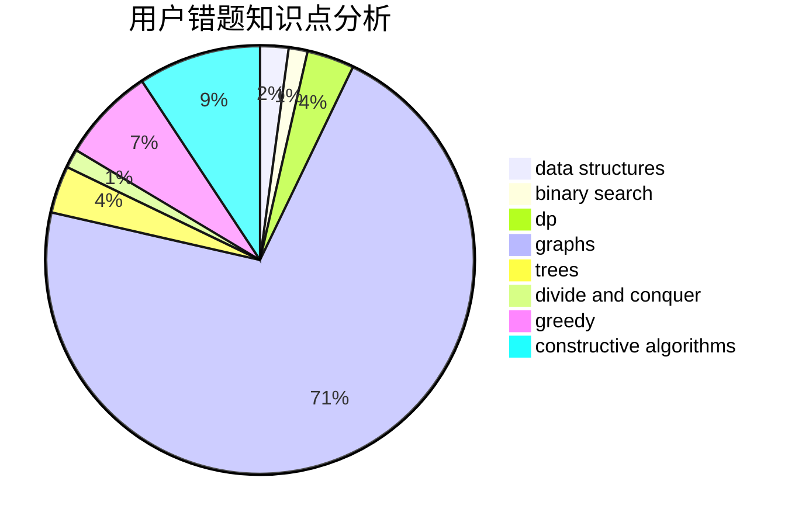

# CWB_the_most_powerful

<!-- tabs:start -->

#### **用户提交结果分析**

#### **用户做题类型偏好分析**

#### **用户错题知识点分析**

<!-- tabs:end -->
# 推荐题目
[1247B1](https://codeforces.com/contest/1247B/problem/1)		dsu,graphs,sortings,trees		  
[1247F](https://codeforces.com/contest/1247/problem/F)		dsu,graphs,sortings,trees		  
[490F](https://codeforces.com/contest/490/problem/F)		data structures,
                        dfs and similar,
                        dp,
                        trees		  
[610C](https://codeforces.com/contest/610/problem/C)		constructive algorithms		  
[3A](https://codeforces.com/contest/3/problem/A)		greedy,
                        shortest paths		  
[581C](https://codeforces.com/contest/581/problem/C)		implementation,
                        math,
                        sortings		  
[1244G](https://codeforces.com/contest/1244/problem/G)		constructive algorithms,
                        greedy,
                        math		  
[618B](https://codeforces.com/contest/618/problem/B)		constructive algorithms		  
[618C](https://codeforces.com/contest/618/problem/C)		geometry,
                        implementation		  
[1161A](https://codeforces.com/contest/1161/problem/A)		dsu,graphs,sortings,trees		  
