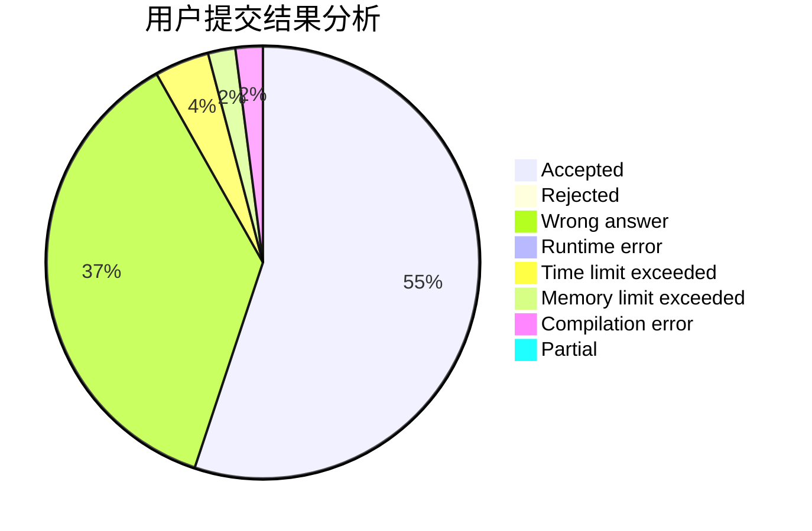
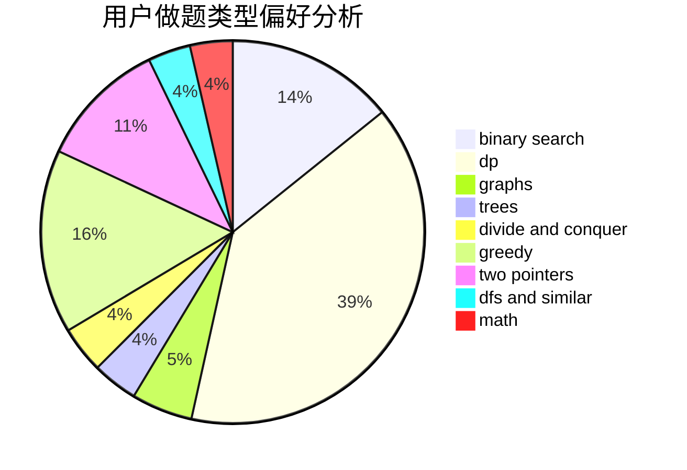

# CWB_the_most_powerful

<!-- tabs:start -->

#### **用户提交结果分析**

#### **用户做题类型偏好分析**

<!-- tabs:end -->
# 推荐题目
[12512](https://codeforces.com/contest/1251/problem/2)
[1251F](https://codeforces.com/contest/1251/problem/F)
[510E](https://codeforces.com/contest/510/problem/E)
[629E](https://codeforces.com/contest/629/problem/E)
[429B](https://codeforces.com/contest/429/problem/B)
[601D](https://codeforces.com/contest/601/problem/D)
[1250B](https://codeforces.com/contest/1250/problem/B)
[638A](https://codeforces.com/contest/638/problem/A)
[638C](https://codeforces.com/contest/638/problem/C)
[1163D](https://codeforces.com/contest/1163/problem/D)
