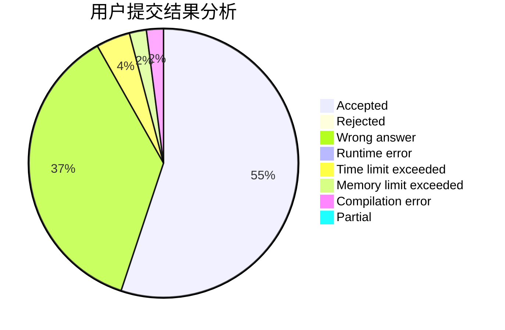
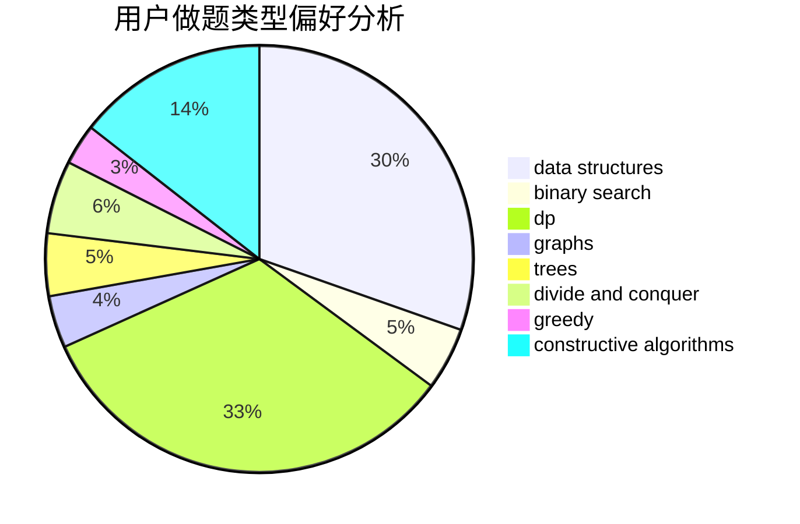
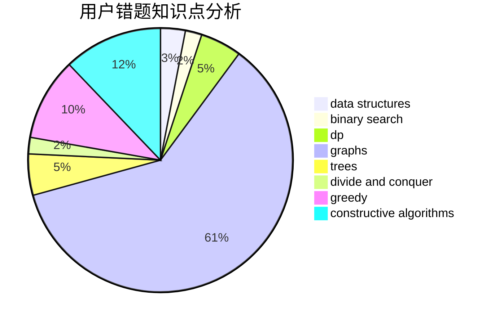

# CWB_the_most_powerful

<!-- tabs:start -->

#### **用户提交结果分析**

#### **用户做题类型偏好分析**

#### **用户错题知识点分析**

<!-- tabs:end -->
# 推荐题目
[12512](https://codeforces.com/contest/1251/problem/2)		dsu,graphs,sortings,trees		  
[1251F](https://codeforces.com/contest/1251/problem/F)		combinatorics,
                        fft		  
[510E](https://codeforces.com/contest/510/problem/E)		flows		  
[629E](https://codeforces.com/contest/629/problem/E)		combinatorics,
                        data structures,
                        dfs and similar,
                        dp,
                        probabilities,
                        trees		  
[429B](https://codeforces.com/contest/429/problem/B)		dp		  
[601D](https://codeforces.com/contest/601/problem/D)		data structures,
                        dfs and similar,
                        dsu,
                        hashing,
                        strings,
                        trees		  
[1250B](https://codeforces.com/contest/1250/problem/B)		brute force,
                        constructive algorithms,
                        greedy,
                        math		  
[638A](https://codeforces.com/contest/638/problem/A)		*special problem,
                        constructive algorithms,
                        math		  
[638C](https://codeforces.com/contest/638/problem/C)		*special problem,
                        dfs and similar,
                        graphs,
                        greedy,
                        trees		  
[1163D](https://codeforces.com/contest/1163/problem/D)		dp,
                        strings		  
