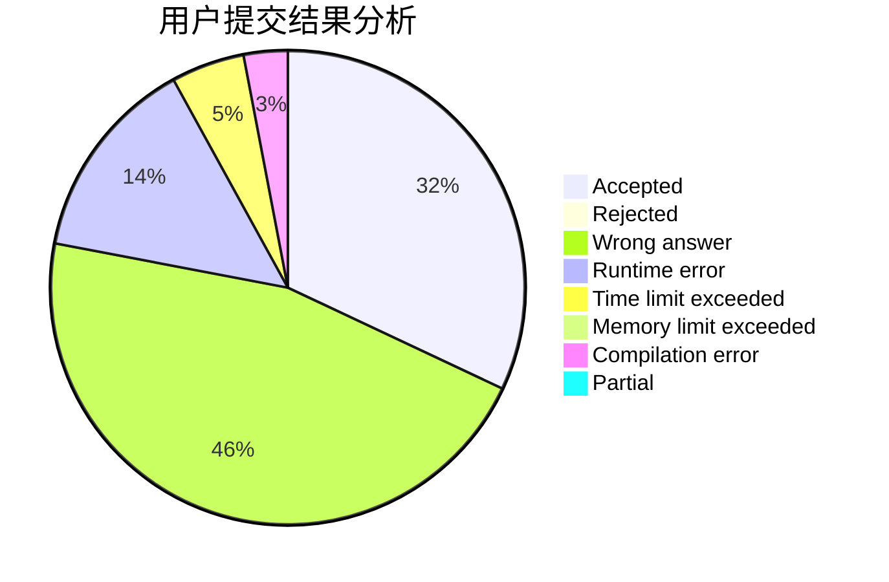
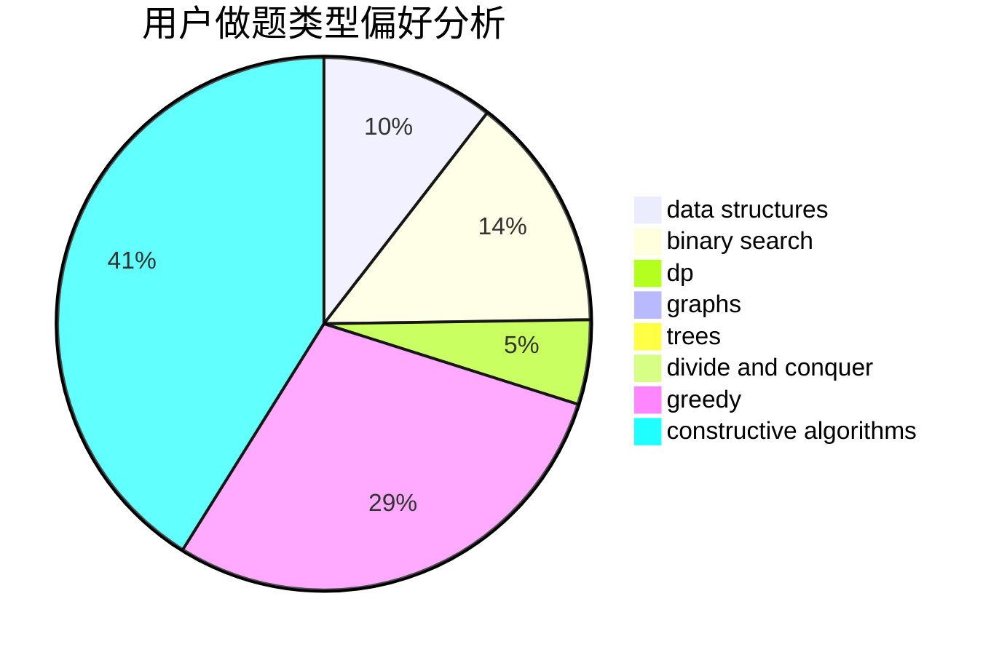
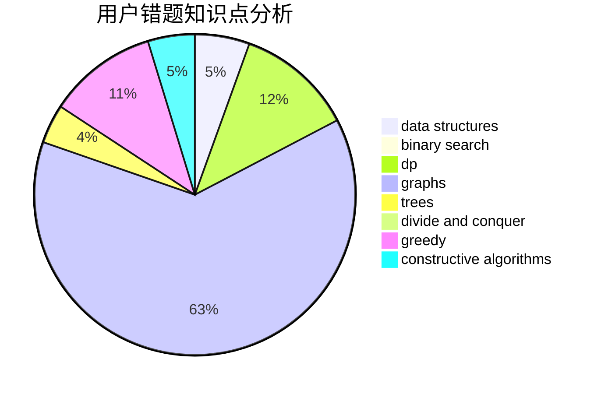

# toish

<!-- tabs:start -->

#### **用户提交结果分析**

#### **用户做题类型偏好分析**

#### **用户错题知识点分析**

<!-- tabs:end -->
# 推荐题目
[813D](https://codeforces.com/contest/813/problem/D)		dp,
                        flows		  
[1354C2](https://codeforces.com/contest/1354C/problem/2)		binary search,
                        brute force,
                        geometry,
                        math		  
[796B](https://codeforces.com/contest/796/problem/B)		implementation		  
[1471D](https://codeforces.com/contest/1471/problem/D)		dsu,graphs,sortings,trees		  
[1438B](https://codeforces.com/contest/1438/problem/B)		constructive algorithms,
                        data structures,
                        greedy,
                        sortings		  
[1335D](https://codeforces.com/contest/1335/problem/D)		constructive algorithms,
                        implementation		  
[1481A](https://codeforces.com/contest/1481/problem/A)		greedy,
                        strings		  
[1420A](https://codeforces.com/contest/1420/problem/A)		math,
                        sortings		  
[1340A](https://codeforces.com/contest/1340/problem/A)		brute force,
                        data structures,
                        greedy,
                        implementation		  
[961B](https://codeforces.com/contest/961/problem/B)		data structures,
                        dp,
                        implementation,
                        two pointers		  
