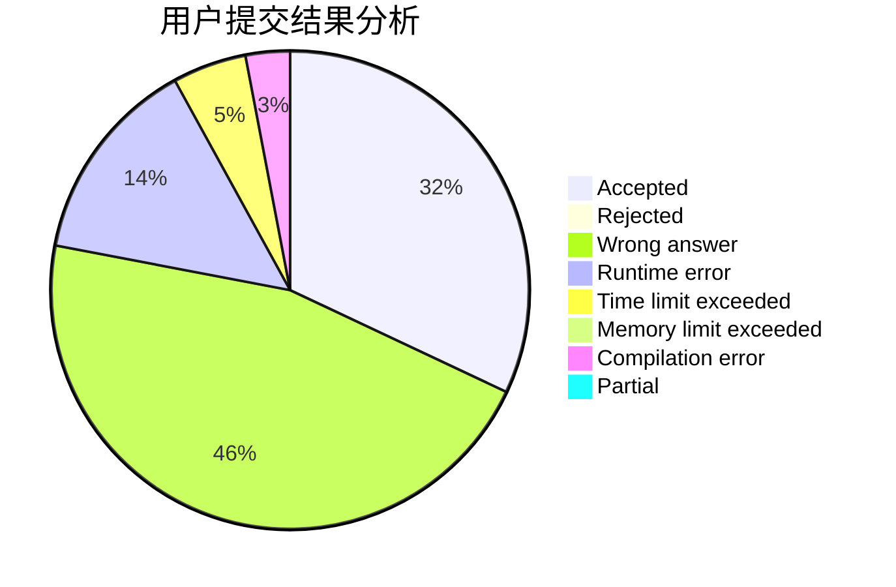
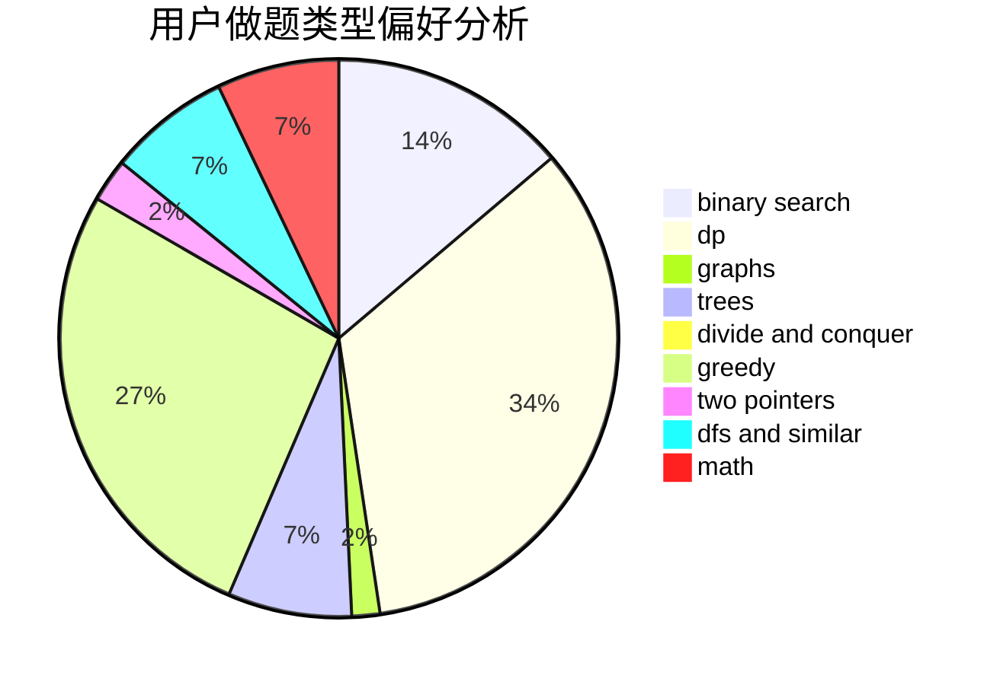

# toish

<!-- tabs:start -->

#### **用户提交结果分析**

#### **用户做题类型偏好分析**

<!-- tabs:end -->
# 推荐题目
[831F](https://codeforces.com/contest/831/problem/F)
[1360H](https://codeforces.com/contest/1360/problem/H)
[810C](https://codeforces.com/contest/810/problem/C)
[147B](https://codeforces.com/contest/147/problem/B)
[144B](https://codeforces.com/contest/144/problem/B)
[1342D](https://codeforces.com/contest/1342/problem/D)
[1489C](https://codeforces.com/contest/1489/problem/C)
[1427H](https://codeforces.com/contest/1427/problem/H)
[1346F](https://codeforces.com/contest/1346/problem/F)
[983C](https://codeforces.com/contest/983/problem/C)
