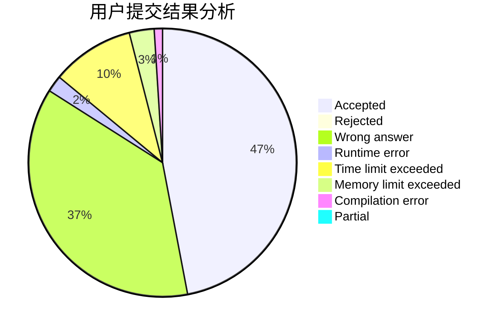
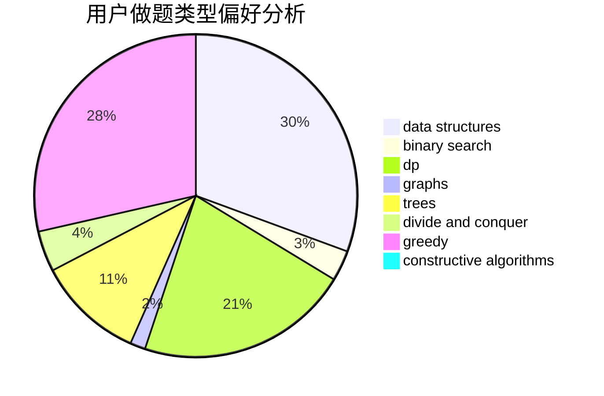
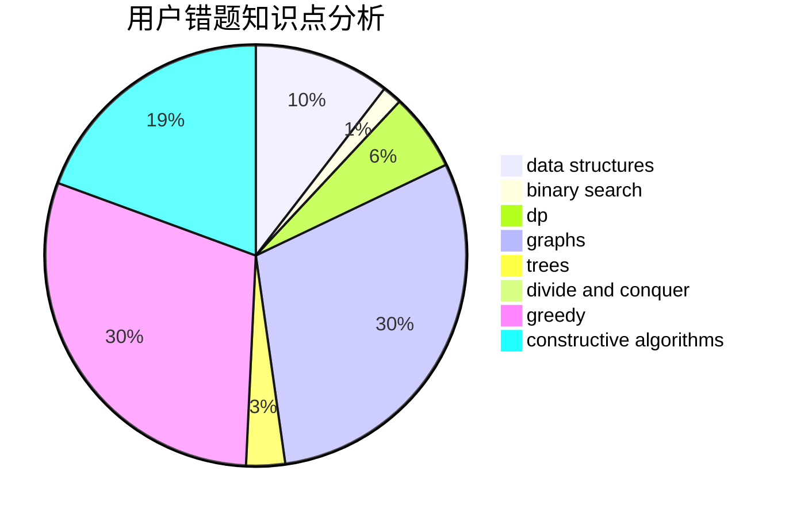

# tom0727

<!-- tabs:start -->

#### **用户提交结果分析**

#### **用户做题类型偏好分析**

#### **用户错题知识点分析**

<!-- tabs:end -->
# 推荐题目
[234A](https://codeforces.com/contest/234/problem/A)		implementation		  
[961F](https://codeforces.com/contest/961/problem/F)		binary search,
                        hashing,
                        string suffix structures		  
[446D](https://codeforces.com/contest/446/problem/D)		math,
                        matrices,
                        probabilities		  
[651B](https://codeforces.com/contest/651/problem/B)		greedy,
                        sortings		  
[294E](https://codeforces.com/contest/294/problem/E)		dp,
                        trees		  
[780G](https://codeforces.com/contest/780/problem/G)		data structures,
                        dp		  
[1136D](https://codeforces.com/contest/1136/problem/D)		greedy		  
[243B](https://codeforces.com/contest/243/problem/B)		graphs,
                        sortings		  
[506C](https://codeforces.com/contest/506/problem/C)		dsu,graphs,sortings,trees		  
[1453E](https://codeforces.com/contest/1453/problem/E)		binary search,
                        dfs and similar,
                        dp,
                        greedy,
                        trees		  
